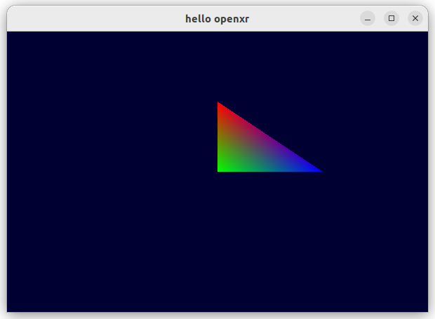
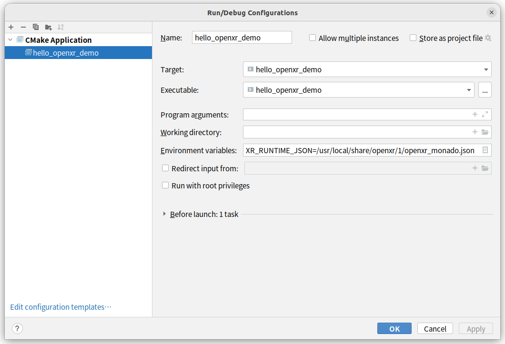
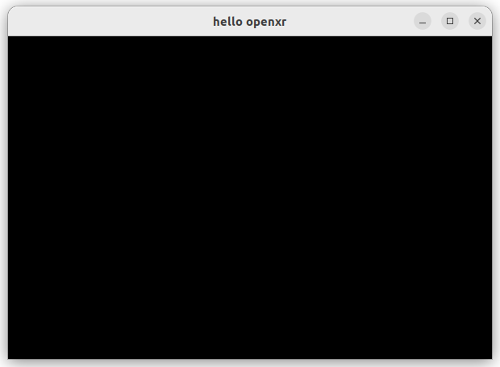

## 1 概要

本文目标是实现一个最小化OpenXR应用程序，只渲染一个三角形，渲染库采用的是OpenGL，窗口管理使用[GLFW](https://link.zhihu.com/?target=https%3A//www.glfw.org/)，OpenXR Runtime使用的是[Monado](https://link.zhihu.com/?target=https%3A//monado.dev/)。因为Monado目前支持的是安卓和Linux平台，本人测试使用的是**Ubuntu系统**，所以这个DEMO可以在Ubuntu系统下正常运行，但别的系统还没有经过严格测试。



## 2 环境准备

点击[下载cmake](https://cmake.org/download/)，如果使用apt安装，可能版本号过低。

```shell
cd cmake-xxxx
sudo apt install -y libssl-dev
sudo ./configure
sudo make -j8
sudo make install
```

Monado安装需要的第三方库。

**glslang**

```shell
git clone https://github.com/KhronosGroup/glslang
mkdir build
cd build
make
sudo make install
```

**Eigen3**

```shell
git clone https://gitlab.com/libeigen/eigen.git
mkdir build
cd build
make
sudo make install
```

### 2.1 Monado

clone Monado并启动Monado-Service

```shell
git clone https://gitlab.freedesktop.org/monado/monado.git
```

clone成功后，进入Monado源码目录，创建build文件夹

```shell
cd monado/
mkdir build
cd build
```

执行make

```shell
cmake ..
make
sudo make install
```

如果安装成功，会有下面类似的输出

```shell
...
...

-- Installing OpenXR runtime manifest with JSON-relative path to runtime
-- Installing: /usr/local/share/openxr/1/openxr_monado.json
-- Installing: /usr/local/lib/libopenxr_monado.so
-- Installing: /usr/local/bin/monado-cli
-- Installing: /usr/local/bin/monado-gui
-- Installing: /usr/local/bin/monado-ctl
-- Installing: /usr/local/bin/monado-service
-- Up-to-date: /usr/local/share/steamvr-monado
-- Up-to-date: /usr/local/share/steamvr-monado/resources

...
...
```

那么在启动OpenXR应用程序的时候，只需要配置`XR_RUNTIME_JSON=/usr/local/share/openxr/1/openxr_monado.json`的环境变量就可以启动并使用Monado作为Runtime。

```shell
XR_RUNTIME_JSON=/usr/local/share/openxr/1/openxr_monado.json ./hello_openxr_demo
```

在CLion中启动。



不过，**在启动OpenXR应用程序之前，应先启动monado-service服务。**

```shell
monado-service
```

**注意：如果启动成功，你敲击回车键就会结束monado-service进程，记住不要回车。也正因如此，只有回车才能正常结束，如果是其他方式结束，可能导致退出不干净，出现以下错误：**

```shell
ERROR [create_listen_socket] Could not bind socket to path /run/user/1000/monado_comp_ipc: Address already in use. Is the service running already?
ERROR [create_listen_socket] If monado-service is not running, delete /run/user/1000/monado_comp_ipc before starting a new instance
ERROR [init_all] Failed to init ipc main loop!
```

这种情况执行`rm -rf /run/user/1000/monado_comp_ipc`就可以重新启动monado-service。

### 2.2 OpenXR SDK

Clone下来OpenXR SDK source源码

```shell
git clone https://github.com/KhronosGroup/OpenXR-SDK-Source.git
```

和上述Monado安装一样，创建build文件夹并执行`make install`

### 2.3 GLFW

```shell
sudo apt install libglfw3-dev
```

### 2.4 glad

下载地址：https://glad.dav1d.de

| 配置          | 值        |
| :------------ | :-------- |
| Language      | C/C++     |
| Specification | OpenGL    |
| API.gl        | Verson4.4 |

> 可以参考我之前写过的文章，[03_OpenGL环境搭建](opengl_renderer/03_opengl环境搭建.html)

## 3 工程框架

项目名，我起一个叫`hello_openxr_demo`，把glad引入之后，创建一个`CMakeLists.txt`

```shell
/
hello_openxr_demo/
├── CMakeLists.txt
├── glad.c
├── include
│   ├── glad
│   │   └── glad.h
│   └── KHR
│       └── khrplatform.h
└── main.cpp
```

`CMakeLists.txt`内容

```cmake
cmake_minimum_required(VERSION 3.24)
project(hello_openxr_demo)

set(CMAKE_CXX_STANDARD 14)

include_directories("include")

add_executable(hello_openxr_demo main.cpp glad.c)

# OpenGL
find_package(OpenGL REQUIRED)

# X11
find_package(X11 REQUIRED)
SET(LINUX_LIBS "Xrandr ${X11_LIBRARIES}" m)

# OpenXR
find_package(OpenXR REQUIRED)
target_include_directories(hello_openxr_demo PRIVATE OpenXR::Headers)
target_link_libraries(hello_openxr_demo PRIVATE OpenXR::openxr_loader)

# glfw3
find_package(glfw3 REQUIRED)
target_link_libraries(hello_openxr_demo PRIVATE glfw)

#xlib
target_link_libraries(hello_openxr_demo PRIVATE ${LINUX_LIBS} ${OPENGL_LIBRARIES})
```

目前`main.cpp`是最基础的代码内容

```c++
#include <cstring>
#include "glad/glad.h"
#include <GL/glext.h>

#include <X11/Xlib.h>
#include <GL/glx.h>

#include <iostream>

#define XR_USE_PLATFORM_XLIB //指定平台
#define XR_USE_GRAPHICS_API_OPENGL //指定渲染API
#define XR_EXTENSION_PROTOTYPES
#include <openxr/openxr.h>
#include <openxr/openxr_platform.h>

#include <GLFW/glfw3.h>

int main() {
    std::cout << "Hello, OpenXR demo!" << std::endl;
    return EXIT_SUCCESS;
}
```

**主要流程分为三个**

1、初始化

2、主循环

3、回收

```c++
void init();
void frame();
void cleanUp();
```

### 3.1 初始化

1、创建OpenXR instance

2、创建OpenXR Session

3、创建局部坐标系

4、创建交换链

5、初始化视图

6、初始化OpenGL

```c++
void init(){
    createInstance();
    createSession();
    createSpace();
    createSwapchain();
    initViews();
    initGl();
}
```

#### **3.1.1 创建XrInstance**

所有和OpenXR有关的函数，基本上都遵循以下规律：

```c++

XxxInstance xxx;
XrXxxCreateInfo createInfo = {
    .type = XR_TYPE_XXXX_CREATE_INFO,
    //...
};

xrCreateXxx(XXX, &createInfo, &xxx);
```

其中有两个重要对象，一个是要创建的对象本身，比如XrInstance、XrSession、XrSpace等等，另一个是创建该对象的配置对象CreateInfo，比如XrInstanceCreateInfo、XrSessionCreateInfo...

所以，我们要创建一个OpenXR对象，首先想到的就是上面这个规律。

> 其实Vulkan的API也是这个规律。

另外，很多调用OpenXR API返回的是XrResult，我们可以判断XrResult是否是XR_SUCEESS，从而决定是否继续下面的逻辑。在这DEMO中，我定义一个宏来处理。

```c++
//判断openxr接口调用情况
#define CALL_XR(result) {           \
     if(XR_SUCCESS != result){      \
            std::string info;       \
            info += __FILE__;                       \
            info += "[" + std::to_string(__LINE__) + "]";\
            info += ": call openxr function error~";     \
            throw std::runtime_error(info.c_str());      \
     }                                                   \
}
```

创建XrInstance就可以这样实现：

```c++
void createInstance(){
    XrInstanceCreateInfo createInfo = {
		//TODO
    };
    CALL_XR(xrCreateInstance(&createInfo, &instance)); //可以定义全局变量，instance
}
```

现在重点就是组装`XrInstanceCreateInfo`对象了。

在组装CreateInfo对象的过程中，如果没有组装必填参数，会返回以下报错。

```shell
Error [GENERAL | xrCreateInstance | OpenXR-Loader] : VUID-XrApplicationInfo-engineName-parameter: application name can not be empty.
Error [SPEC | xrCreateInstance | VUID-XrInstanceCreateInfo-applicationInfo-parameter] : info->applicationInfo is not valid.
```

我们可以根据报错找到哪些参数必填，在这个DEMO中我尽量只填必不可少的参数。

所以，application的组装如下:

```c++
XrApplicationInfo applicationInfo = {
        .applicationName = "hello openxr",
        .applicationVersion = 1,
        .engineName = "no engine",
        .engineVersion = 0,
        .apiVersion = XR_CURRENT_API_VERSION,
};
```

另外，我们需要添加`XR_KHR_OPENGL_ENABLE_EXTENSION_NAME`支持OpenGL的扩展。

> 扩展相关可以参考OpenXR官方的[扩展说明](https://registry.khronos.org/OpenXR/specs/1.0/html/xrspec.html#extensions)

现在`create_instance`的实现如下：

```c++
XrInstance instance;//全局变量
void createInstance(){
    const char *extensions[] = { XR_KHR_OPENGL_ENABLE_EXTENSION_NAME };
    int extension_count = sizeof(extensions) / sizeof(extensions[0]);

    XrApplicationInfo applicationInfo = {
            .applicationName = "hello openxr",
            .applicationVersion = 1,
            .engineName = "no engine",
            .engineVersion = 0,
            .apiVersion = XR_CURRENT_API_VERSION,
    };

    XrInstanceCreateInfo createInfo = {
        .type = XR_TYPE_INSTANCE_CREATE_INFO,
        .next = nullptr,
        .createFlags = 0,
        .applicationInfo = applicationInfo,
        .enabledApiLayerCount = 0,
        .enabledApiLayerNames = nullptr,
        .enabledExtensionCount = static_cast<uint32_t>(extension_count),
        .enabledExtensionNames = reinterpret_cast<const char *const *>(extensions),
    };
    CALL_XR(xrCreateInstance(&createInfo, &instance));
}
```

#### 3.1.2 创建Session

同理，先搭建结构。

```c++
XrSession session;//全局变量
void createSession(){

    XrSessionCreateInfo sessionCreateInfo = {
        .type = XR_TYPE_SESSION_CREATE_INFO
    };

    CALL_XR(xrCreateSession(instance, &sessionCreateInfo, &session));
}
```

组装参数，分为 4 个步骤：

1、获得System信息

```c++
XrSystemId systemId;//全局变量
XrSystemGetInfo systemGetInfo = {
        .type = XR_TYPE_SYSTEM_GET_INFO,
        .next = nullptr,
        //XR_FORM_FACTOR_HEAD_MOUNTED_DISPLAY: 跟踪显示器连接到用户的头部。用户不能触摸显示器本身。VR头显就是这种形式的一个例子。
        //XR_FORM_FACTOR_HANDHELD_DISPLAY：跟踪显示是在用户的手中，独立于用户的头部。用户可以触摸显示器，允许使用屏幕空间的UI。使用直通视频运行AR体验的手机就是这种形式因素的一个例子。
        .formFactor = XR_FORM_FACTOR_HEAD_MOUNTED_DISPLAY,
};
CALL_XR(xrGetSystem(instance, &systemGetInfo, &systemId));
```

2、查询渲染API的需求条件

```c++
PFN_xrGetOpenGLGraphicsRequirementsKHR pfnXrGetOpenGlGraphicsRequirementsKhr;
CALL_XR(xrGetInstanceProcAddr(instance, "xrGetOpenGLGraphicsRequirementsKHR",
                      reinterpret_cast<PFN_xrVoidFunction*>(&pfnXrGetOpenGlGraphicsRequirementsKhr)));
XrGraphicsRequirementsOpenGLKHR graphicsRequirements = {XR_TYPE_GRAPHICS_REQUIREMENTS_OPENGL_KHR};
CALL_XR(pfnXrGetOpenGlGraphicsRequirementsKhr(instance, systemId, &graphicsRequirements));
```

3、渲染API绑定

```c++
XrGraphicsBindingOpenGLXlibKHR graphicsBinding = {
        .type = XR_TYPE_GRAPHICS_BINDING_OPENGL_XLIB_KHR,
        .next = nullptr,
        //... 在 initWindow() 中初始化
};
```

4、初始化窗口

```c++
GLFWwindow* pWindow;
void initWindow(XrGraphicsBindingOpenGLXlibKHR* graphicsBinding){
    if(!glfwInit()){
        throw std::runtime_error("failed to init glfw.");
    }
    glfwWindowHint(GLFW_CONTEXT_VERSION_MAJOR, 4);// 主版本
    glfwWindowHint(GLFW_CONTEXT_VERSION_MINOR, 0);// 次版本
    glfwWindowHint(GLFW_OPENGL_PROFILE, GLFW_OPENGL_CORE_PROFILE);//使用核心模式

    pWindow = glfwCreateWindow(WIDTH, HEIGHT, "hello openxr", nullptr, nullptr);
    if(!pWindow){
        throw std::runtime_error("failed to create window.");
    }
    glfwMakeContextCurrent(pWindow);

    bool bLoadSuc = gladLoadGLLoader((GLADloadproc) glfwGetProcAddress);
    if(!bLoadSuc){
        throw std::runtime_error("failed glad load glProcAddress!");
    }

    //debug
    glEnable(GL_DEBUG_OUTPUT);

    //设置值
    graphicsBinding->xDisplay = XOpenDisplay(nullptr);
    graphicsBinding->glxContext = glXGetCurrentContext();
    graphicsBinding->glxDrawable = glXGetCurrentDrawable();
}
```

最终获得`XrGraphicsBindingOpenGLXlibKHR`对象，将其赋值给`XrSessionCreateInfo`的next字段。然后调用`xrCreatSession()`。

```c++
//... 渲染API绑定
//初始化窗口
initWindow(&graphicsBinding);

//创建session
XrSessionCreateInfo sessionCreateInfo = {
    .type = XR_TYPE_SESSION_CREATE_INFO,
    .next = reinterpret_cast<const XrBaseInStructure*>(&graphicsBinding),
    .createFlags = 0,
    .systemId = systemId
};

CALL_XR(xrCreateSession(instance, &sessionCreateInfo, &session));
```

此时，运行可以看到一个窗口一闪而过。




#### 3.1.3 创建ReferenceSpace

ReferenceSpace，参考空间。包括视图(VIEW)、本地（LOCAL）和舞台（STAGE），向OpenXR接口传递坐标时，需要向函数传递一个参考系；返回坐标时，也会带上一个XrSpace来表示这些坐标的参照系，应用程序可以使用他们进行空间转换。

创建参考空间的代码结构。

```c++
XrSpace appSpace;//全局变量

XrPosef identity = {
        .orientation = {0, 0, 0, 1},
        .position = {0, 0, 0},
};
void createSpace(){
    XrReferenceSpaceCreateInfo createInfo = {
        .type = XR_TYPE_REFERENCE_SPACE_CREATE_INFO,
        .next = nullptr,
        //暂时使用本地参考系
        .referenceSpaceType = XR_REFERENCE_SPACE_TYPE_LOCAL,
        .poseInReferenceSpace = identity
    };
    CALL_XR(xrCreateReferenceSpace(session, &createInfo, &appSpace));
}
```

#### 3.1.4 创建交换链

代码结构

```c++
void createSwapchain(){
    //1、查询交换链支持的格式
    xrEnumerateSwapchainFormats()
    //2、查询视图数量
    xrEnumerateViewConfigurationViews()
    //3、每个视图分别创建swapchain和设置swapchain images
    for(viewConfigs) {
        xrCreateSwapchain();
    }
}
```

1、查询交换链支持格式，选择合适格式。

```c++
uint32_t formatCountOutput;
CALL_XR(xrEnumerateSwapchainFormats(session, 0, &formatCountOutput, nullptr));
if(formatCountOutput <= 0){
    throw std::runtime_error("can not find swapchain support formats!");
}
int64_t formats[formatCountOutput];
CALL_XR(xrEnumerateSwapchainFormats(session, formatCountOutput, &formatCountOutput, formats));
//color format
int64_t  colorFormat = chooseFormat(formats, formatCountOutput, GL_SRGB8_ALPHA8_EXT, true);
```

格式选择，可以支持降级，如果没有找到合适的支持格式，就选择第一个格式。

```c++
/**
 * @param array 格式列表
 * @param arrayCount 格式列表数量
 * @param shouldChoose 最佳选择
 * @param fallback 是否降级
 * @return 选择的格式
 */
int64_t chooseFormat(const int64_t* array, uint32_t arrayCount, int64_t shouldChoose, bool fallback) {
    if(arrayCount <= 0){
        throw std::runtime_error("arrayCount is required!");
    }
    int64_t chooseFormat = -1;
    for(int i = 0; i < arrayCount; i++){
        if(shouldChoose == array[i]){
            chooseFormat = array[i];
            break;
        }
    }

    if(chooseFormat == -1 && fallback){
        chooseFormat = array[0];
    }

    return chooseFormat;
}
```

2、查询视图数量

```c++
std::vector<XrViewConfigurationView> configurationViews;//全局变量

uint32_t configViewCount;
CALL_XR(xrEnumerateViewConfigurationViews(instance, systemId, XR_VIEW_CONFIGURATION_TYPE_PRIMARY_STEREO,
                                          0, &configViewCount,nullptr));
if(configViewCount <= 0){
    throw std::runtime_error("can not find config views!");
}
configurationViews.resize(configViewCount);
CALL_XR(xrEnumerateViewConfigurationViews(instance, systemId, XR_VIEW_CONFIGURATION_TYPE_PRIMARY_STEREO,
                                          0, &configViewCount, configurationViews.data()));
```

3、创建swapchain和设置swapchain images

```c++
std::vector<XrSwapchain> swapchains;//全局变量

swapchains.resize(configViewCount);
for(int i = 0; i < configViewCount; i++){
    XrSwapchainCreateInfo createInfo = {
        .type = XR_TYPE_SWAPCHAIN_CREATE_INFO,
        .next = nullptr,
        .createFlags = 0,
        .usageFlags = XR_SWAPCHAIN_USAGE_COLOR_ATTACHMENT_BIT | XR_SWAPCHAIN_USAGE_SAMPLED_BIT,
        .format = colorFormat,
        .sampleCount = configurationViews[i].maxSwapchainSampleCount,
        .width = WIDTH,
        .height = HEIGHT,
        .faceCount = 1,
        .arraySize = 1,
        .mipCount = 1
    };
    CALL_XR(xrCreateSwapchain(session, &createInfo, &swapchains[i]));

    uint32_t imageCountOutput;
    CALL_XR(xrEnumerateSwapchainImages(swapchains[i], 0, &imageCountOutput, nullptr));
    if(imageCountOutput > 0){
        swapchainImages.resize(imageCountOutput);
        for (auto &item: swapchainImages) {
            item.type = XR_TYPE_SWAPCHAIN_IMAGE_OPENGL_KHR;
        }

        CALL_XR(xrEnumerateSwapchainImages(swapchains[i], 0, &imageCountOutput,
                                           reinterpret_cast<XrSwapchainImageBaseHeader *>(swapchainImages.data())));
    }
}
```

#### 3.1.5 初始化视图

我们先根据配置视图数量创建投影视图`XrCompositionLayerProjectionView`即可。

```c++
std::vector<XrCompositionLayerProjectionView> projectionViews;//全局变量
XrFovf identityFov = {
        .angleLeft = 0,
        .angleRight = 0,
        .angleUp = 0,
        .angleDown = 0,
};//全局变量
std::vector<XrView> views;//全局变量

void initViews(){
    views.resize(configurationViews.size());
    for (auto &item: views) {
        item.type = XR_TYPE_VIEW;
        item.next = nullptr;
    }
    
    uint32_t size = configurationViews.size();
    projectionViews.resize(size);
    for(int i = 0; i < size; i++){
        projectionViews[i].type = XR_TYPE_COMPOSITION_LAYER_PROJECTION_VIEW;
        projectionViews[i].next = nullptr;
        projectionViews[i].pose = identity;
        projectionViews[i].fov = identityFov;
        projectionViews[i].subImage.swapchain = swapchains[i];
        projectionViews[i].subImage.imageRect.offset = {0, 0};
        projectionViews[i].subImage.imageRect.extent = {WIDTH, HEIGHT};
        projectionViews[i].subImage.imageArrayIndex = 0;
    }
}
```

#### 3.1.6 初始化GL

1、我们先定义一个顶点着色器和片元着色器，暂时只是最简单的显示顶点颜色。

```c++
static const char* vertexshader =
        "#version 330 core\n"
        "layout(location = 0) in vec3 aPos;\n"
        "layout(location = 1) in vec4 aColor;\n"
        "out vec4 vertexColor;\n"
        "void main() {\n"
        "	gl_Position = vec4(aPos, 1.0);\n"
        "	vertexColor = aColor;\n"
        "}\n";

static const char* fragmentshader =
        "#version 330 core\n"
        "in vec4 vertexColor;\n"
        "out vec4 FragColor;\n"
        "void main() {\n"
        "	FragColor = vertexColor;\n"
        "}\n";
```

2、创建`Geometry`结构体，然后根据配置视图数量，创建`FrameBuffer`

```c++
struct Geometry {
    GLuint shaderProgramId; //着色器程序
    std::vector<GLuint> frameBuffers;//帧缓冲列表
    GLuint VAO;//顶点数组对象
};
Geometry geometry;//全局变量

void initGl() {
    uint32_t size = configurationViews.size();
    geometry.frameBuffers.resize(size);
    for(int i = 0; i < size; i++){
        glGenFramebuffers(1, &geometry.frameBuffers[i]);
    }
    
    ...
    ...
}
```

3、编译着色器，获得着色器程序

```c++
/**
 * 编译着色器
 * @param type 类型
 * @param source 源码
 * @return 着色器id，如果失败抛出runtime_error
 */
GLuint compileShader(GLuint type, const char* source){
    GLuint rt = glCreateShader(type);
    const GLchar* glCharSource[] = {source};
    glShaderSource(rt, 1, glCharSource, nullptr);
    glCompileShader(rt);

    GLint suc;
    glGetShaderiv(rt, GL_COMPILE_STATUS, &suc);
    if(suc < 0){
        GLchar log[512];
        glGetShaderInfoLog(rt, 512, nullptr, log);
        throw std::runtime_error(log);
    }
    return rt;
}

void initGl() {
    uint32_t size = configurationViews.size();
    geometry.frameBuffers.resize(size);
    for(int i = 0; i < size; i++){
        glGenFramebuffers(1, &geometry.frameBuffers[i]);
    }

    //编译着色器
    GLuint vsId = compileShader(GL_VERTEX_SHADER, vertexShaderSource);
    GLuint fsId = compileShader(GL_FRAGMENT_SHADER, fragmentShaderSource);
    geometry.shaderProgramId = glCreateProgram();
    glAttachShader(geometry.shaderProgramId, vsId);
    glAttachShader(geometry.shaderProgramId, fsId);

    glDeleteShader(vsId);
    glDeleteShader(fsId);

    glLinkProgram(geometry.shaderProgramId);
    GLint suc;
    glGetProgramiv(geometry.shaderProgramId, GL_LINK_STATUS, &suc);
    if(suc < 0){
        GLchar log[512];
        glGetProgramInfoLog(geometry.shaderProgramId, 512, nullptr, log);
        throw std::runtime_error(log);
    }
}
```

4、设置顶点数组对象VAO，这里只简单设置位置和颜色。

```c++
/**
 * 设置顶点数组对象
 * @param vao Vertex Array Object
 */
void setVAO(GLuint* vao){
    float vertices[] = {
            0.0f, 0.5f, 0.0f, //第一个顶点
            0.0f, 0.0f, 0.0f, //第二个顶点
            0.5f, 0.0f, 0.0f, //第三个顶点
    };

    float colors[] = {
            1.0f, 0.0f, 0.0f, 1.0f,
            0.0f, 1.0f, 0.0f, 1.0f,
            0.0f, 0.0f, 1.0f, 0.0f
    };

    glGenVertexArrays(1, vao);
    glBindVertexArray(*vao);

    GLuint vbos[2];
    glGenBuffers(2, vbos);

    glBindBuffer(GL_ARRAY_BUFFER, vbos[0]);
    glBufferData(GL_ARRAY_BUFFER, sizeof(vertices), vertices, GL_STATIC_DRAW);
    glEnableVertexAttribArray(0);
    glVertexAttribPointer(0, 3, GL_FLOAT, GL_FALSE, 0, nullptr);

    glBindBuffer(GL_ARRAY_BUFFER, vbos[1]);
    glBufferData(GL_ARRAY_BUFFER, sizeof(colors), colors, GL_STATIC_DRAW);
    glEnableVertexAttribArray(1);
    glVertexAttribPointer(1, 4, GL_FLOAT, GL_FALSE, 0, nullptr);

    glBindVertexArray(0);
}
```

5、然后，在`void initGl()`中调用。

```c++
void initGl() {
	...
    ...
    if(suc < 0){
        GLchar log[512];
        glGetProgramInfoLog(geometry.shaderProgramId, 512, nullptr, log);
        throw std::runtime_error(log);
    }

    setVAO(&geometry.VAO);
}
```

### 3.2 主循环

初始化的工作已经完毕，我们得到了instance、session、space、swapchain、view，还初始化了OpenGL和集合体（目前就是三个顶点构成的三角形）对象。

接下来，我们之前的`void frame()`函数就要开始工作了，这个函数的主要任务就是循环渲染。

```c++
void pollXrEvents(bool* quitLoop, bool* shouldRender){}
void rendFrame(){}

void frame(){
    bool quitLoop = false; //标识是否结束循环
    bool shouldRender;//是否可以渲染

    while (!quitLoop) {
        glfwPollEvents();
        if(glfwWindowShouldClose(pWindow)) {
            quitLoop = true;
        }

        pollXrEvents(&quitLoop, &shouldRender);
        if(quitLoop){
            break;//退出循环
        }

        //渲染
        if(shouldRender) {
            rendFrame();
        }
    }
}
```

所以现在目标就是实现`pollXrEvents()`和`rendFrame()`。

#### 3.2.1 处理OpenXR事件

为了简化，我们只处理两种事件：

XR_TYPE_EVENT_DATA_INSTANCE_LOSS_PENDING：丢失连接

XR_TYPE_EVENT_DATA_SESSION_STATE_CHANGED：session状态变化

```c++
void pollXrEvents(bool* quitLoop, bool* shouldRender){
    XrEventDataBuffer eventDataBuffer = {
        .type = XR_TYPE_EVENT_DATA_BUFFER,
        .next = nullptr,
    };
    XrResult result = xrPollEvent(instance, &eventDataBuffer);
    if(result != XR_SUCCESS){
        return;
    }

    //处理事件
    switch (eventDataBuffer.type) {
        default:
            std::cout << "do not dispose this event: " << eventDataBuffer.type << std::endl;
            break;
        case XR_TYPE_EVENT_DATA_INSTANCE_LOSS_PENDING: //丢失连接
            std::cout << "instance_loss_pending" << std::endl;
            *quitLoop = true;
            break;
        case XR_TYPE_EVENT_DATA_SESSION_STATE_CHANGED: //session状态变化
            std::cout << "session_state_changed" << std::endl;
            auto* event = (XrEventDataSessionStateChanged*) &eventDataBuffer;
            onSessionStateChangedEvent(event, quitLoop, shouldRender);
            break;
    }
}
```

其中，session生命周期和渲染息息相关，所以我们单独抽取了一个`onSessionStateChangedEvent()`。

可以参考我写的这篇文章：[Session的生命周期](http://adiosy.com/posts/open_xr/01_Monado%E6%B8%B2%E6%9F%93%E6%B5%81%E7%A8%8B/#1-session)

现在我们只处理这几种状态：

1、**未知或者空闲状态**，此时未知session状态，暂停渲染循环，即`shouldRender=false`；

2、FOCUSED、SYNCHRONIZED、VISIBLE表示正在循环中，此时正常渲染，即`shouldRender=true`；

3、READY就绪状态，此时表示session已经就绪，需要调用`xrBeginSession`，并开启渲染循环`shouldRender=true`；

4、STOPPING停止状态，此时表示Session停止，需要调用`xrEndSession`，并停止渲染循环`shouldRender=false`；

5、LOSS_PENDING或EXITING，此时丢失连接或退出Session，需要调用`xrDestroySession`，并退出和停止循环，即`quitLoop=true && shouldRender=false ` 

```c++
bool isSessionRunning;//全局变量
XrSessionState sessionState;//全局变量

//仅为输出测试
static std::string print_session_state(int64_t state){
    switch (state) {
        case XR_SESSION_STATE_UNKNOWN:
            return "unknown";
        case XR_SESSION_STATE_IDLE:
            return "idle";
        case XR_SESSION_STATE_READY:
            return "ready";
        case XR_SESSION_STATE_SYNCHRONIZED:
            return "synchronized";
        case XR_SESSION_STATE_VISIBLE:
            return "visible";
        case XR_SESSION_STATE_FOCUSED:
            return "focused";
        case XR_SESSION_STATE_STOPPING:
            return "stopping";
        case XR_SESSION_STATE_LOSS_PENDING:
            return "loss_pending";
        case XR_SESSION_STATE_EXITING:
            return "exiting";
        case XR_SESSION_STATE_MAX_ENUM:
            return "MAX_ENUM～～it is a bug!";
    }
    return "";
}

void onSessionStateChangedEvent(XrEventDataSessionStateChanged* event, bool* quitLoop, bool* shouldRender){
    auto state = static_cast<XrSessionState>(event->state);
    std::cout << "监测到session状态变化，从" << print_session_state(sessionState) << "变化到：" << print_session_state(state) << std::endl;
    sessionState = state;

    XrSessionBeginInfo beginInfo = {
            .type = XR_TYPE_SESSION_BEGIN_INFO,
            .next = nullptr,
            .primaryViewConfigurationType = XR_VIEW_CONFIGURATION_TYPE_PRIMARY_STEREO
    };

    switch (state) {
        case XR_SESSION_STATE_MAX_ENUM:
        case XR_SESSION_STATE_IDLE:
        case XR_SESSION_STATE_UNKNOWN:
            *shouldRender = true;
            break;

        case XR_SESSION_STATE_FOCUSED:
        case XR_SESSION_STATE_SYNCHRONIZED:
        case XR_SESSION_STATE_VISIBLE:
            *shouldRender = false;
            break;

        case XR_SESSION_STATE_READY:
            if(!isSessionRunning) {
                CALL_XR(xrBeginSession(session, &beginInfo));
            }
            *shouldRender = true;
            break;

        case XR_SESSION_STATE_STOPPING:
            if(isSessionRunning) {
                CALL_XR(xrEndSession(session));
            }
            *shouldRender = false;
            break;

        case XR_SESSION_STATE_EXITING:
        case XR_SESSION_STATE_LOSS_PENDING:
            CALL_XR(xrDestroySession(session));
            *shouldRender = false;
            *quitLoop = true;
            break;
    }
}
```

#### 3.2.2 帧渲染

渲染分为以下7个步骤：

1、`xrWaitFrame()` 等待Frame，需要和xrBeginFrame一起使用

2、`xrBeginFrame()` 开始Frame

3、`xrAcquireSwapchainImage()` 从交换链中获取贴图

4、renderImage() 绘制

5、`xrReleaseSwapchainImage()`释放交换链中贴图

6、`xrxrLocateViews()`获得视图位置

7、提交Layers，并执行`xrEndFrame()`

```c++

void renderImage(int viewIndex, GLuint frameBuffer, const XrSwapchainImageOpenGLKHR& image){}

void rendFrame(){
    //1.waitFrame， 注意需要和 beginFrame成对出现
    XrFrameWaitInfo waitInfo = {
            .type = XR_TYPE_FRAME_WAIT_INFO,
            .next = nullptr
    };
    XrFrameState frameState = {
            .type = XR_TYPE_FRAME_STATE,
            .next = nullptr,
    };
    CALL_XR(xrWaitFrame(session, &waitInfo, &frameState));

    //2.beginFrame
    XrFrameBeginInfo beginInfo = {
            .type = XR_TYPE_FRAME_BEGIN_INFO,
            .next = nullptr
    };
    CALL_XR(xrBeginFrame(session, &beginInfo));

    if(frameState.shouldRender){
        for(int i = 0; i < configurationViews.size(); i++){
            //3. TODO 获取交换链中图片

            //4. 绘制
            renderImage(...);

            //5. TODO 释放交换链中贴图
        }
    }

    //6. 获得视图位置
    uint32_t viewCountOutput;
    XrViewState viewState = {
            .type = XR_TYPE_VIEW_STATE,
            .next = nullptr,
            .viewStateFlags = XR_VIEW_STATE_POSITION_VALID_BIT
    };
    XrViewLocateInfo locateInfo = {
            .type = XR_TYPE_VIEW_LOCATE_INFO,
            .next = nullptr,
            .viewConfigurationType = XR_VIEW_CONFIGURATION_TYPE_PRIMARY_STEREO,
            .displayTime = frameState.predictedDisplayTime,
            .space = appSpace,
    };
    xrLocateViews(session, &locateInfo, &viewState, 0, &viewCountOutput, views.data());

    //7.提交Layers，并执行xrEndFrame()
    XrFrameEndInfo endInfo = {
            .type = XR_TYPE_FRAME_END_INFO,
            .next = nullptr,
            .displayTime = frameState.predictedDisplayTime,
            .environmentBlendMode = XR_ENVIRONMENT_BLEND_MODE_OPAQUE,
            .layerCount = 0,
            .layers = nullptr,
    };
    CALL_XR(xrEndFrame(session, &endInfo));
}

```

现在重点实现 **3.获取交换链中图片** ，还是熟悉的结构。

```c++
...
...
for(int i = 0; i < configurationViews.size(); i++){
    //3. 获取交换链中图片
    XrSwapchainImageAcquireInfo acquireInfo = {
            .type = XR_TYPE_SWAPCHAIN_IMAGE_ACQUIRE_INFO,
            .next = nullptr,
    };
    uint32_t imgIndex;
    CALL_XR(xrAcquireSwapchainImage(swapchains[i], &acquireInfo, &imgIndex));

    XrSwapchainImageWaitInfo imageWaitInfo = {
            .type = XR_TYPE_SWAPCHAIN_IMAGE_WAIT_INFO,
            .next = nullptr,
            .timeout = 1000
    };
    xrWaitSwapchainImage(swapchains[i], &imageWaitInfo);

    //4. 绘制
    renderImage(i, geometry.frameBuffers[i], swapchainImages[i]);

    ...
    ...
}
```

还有释放交换链图像。

```c++
...
...

//5. 释放交换链中贴图
XrSwapchainImageReleaseInfo releaseInfo = {
        .type = XR_TYPE_SWAPCHAIN_IMAGE_RELEASE_INFO,
        .next = nullptr
};
xrReleaseSwapchainImage(swapchains[i], &releaseInfo);
```

在`renderImage(...)`中，我们使用正常的[渲染到帧缓冲](https://learnopengl-cn.github.io/04%20Advanced%20OpenGL/05%20Framebuffers/)的方式进行渲染。

```c++

void renderImage(int viewIndex, GLuint frameBuffer, const XrSwapchainImageOpenGLKHR& image){
    glBindFramebuffer(1, frameBuffer);
    glFramebufferTexture2D(GL_FRAMEBUFFER, GL_COLOR_ATTACHMENT0, GL_TEXTURE_2D, image.image, 0);

    glViewport(0, 0, WIDTH, HEIGHT);
    glScissor(0, 0, WIDTH, HEIGHT);//裁剪
    glClearColor(0.0f, 0.0f, 0.2f, 1.0f);
    glClear(GL_COLOR_BUFFER_BIT);

    glUseProgram(geometry.shaderProgramId);
    glBindVertexArray(geometry.VAO);
    glPointSize(5);
    glDrawArrays(GL_TRIANGLES, 0, 3);

    if (viewIndex == 0) {
        glBlitNamedFramebuffer((GLuint)frameBuffer,             // readFramebuffer
                               (GLuint)0,                       // backbuffer     // drawFramebuffer
                               (GLint)0,                        // srcX0
                               (GLint)0,                        // srcY0
                               (GLint)WIDTH,                    // srcX1
                               (GLint)HEIGHT,                   // srcY1
                               (GLint)0,                        // dstX0
                               (GLint)0,                        // dstY0
                               (GLint)WIDTH,                    // dstX1
                               (GLint)HEIGHT,                   // dstY1
                               (GLbitfield)GL_COLOR_BUFFER_BIT, // mask
                               (GLenum)GL_LINEAR);              // filter
    }

    glBindFramebuffer(GL_FRAMEBUFFER, 0);
}
```

接下来，我们需要修改以下第7个步骤，可以渲染时，需要在`xrEndFrame`时提交一个Layer。

```c++
...
...
xrLocateViews(session, &locateInfo, &viewState, 0, &viewCountOutput, views.data());

int submittedLayerCount = 1;
const XrCompositionLayerBaseHeader* submittedLayers[] = {
        (const XrCompositionLayerBaseHeader* const)&projectionViews};

//如果view State 返回 orientation_valid_bit，就不提交Layer了
if ((viewState.viewStateFlags & XR_VIEW_STATE_ORIENTATION_VALID_BIT) == 0) {
    submittedLayerCount = 0;
}
//如果不能渲染，也不提交Layer了
if (!frameState.shouldRender) {
    submittedLayerCount = 0;
}

//7.提交Layers，并执行xrEndFrame()
XrFrameEndInfo endInfo = {
        .type = XR_TYPE_FRAME_END_INFO,
        .next = nullptr,
        .displayTime = frameState.predictedDisplayTime,
        .environmentBlendMode = XR_ENVIRONMENT_BLEND_MODE_OPAQUE,
        .layerCount = static_cast<uint32_t>(submittedLayerCount),
        .layers = submittedLayers,
};
CALL_XR(xrEndFrame(session, &endInfo));
glfwSwapBuffers(pWindow)
```

### 3.3 回收

```c++
void cleanUp(){
    glDeleteVertexArrays(1, &geometry.VAO);
    glDeleteProgram(geometry.shaderProgramId);
    glDeleteFramebuffers(geometry.frameBuffers.size(), geometry.frameBuffers.data());

    for (const auto &item: swapchains) {
        xrDestroySwapchain(item);
    }
    xrDestroySpace(appSpace);
    glfwDestroyWindow(pWindow);
    glfwTerminate();
    xrDestroySession(session);
    xrDestroyInstance(instance);
}
```

点击运行，应该就可以看到开篇的那个彩色三角形了。

## 4 总结

在搭建好OpenXR开发的环境后，将初始化、主循环和回收三大流程慢慢拆分，就可以发现OpenXR应用端程序的规律。有很多我想要使用的对象，都得先构造一个`createInfo`，传递给OpenXR接口，也就是`xrXxxxCreate(...)`，就可以获得对象。文中穿插了OpenGL渲染的一些内容，比如VAO、VBO、FBO等等，会发现其实OpenXR和OpenGL在结构和调用方面还是有相似之处的。

本文是OpenXR应用程序开篇，后续我的计划是研究基于Monado的OpenXR Runtime、OpenXR和Runtime之间的通信流程等等，后续也会尝试使用Vulkan实现OpenXR绘制、安卓应用绘制等。

本文涉及源码连接：https://gitee.com/xingchen0085/hello_openxr_demo

**参考**

[The OpenXR Specification](https://registry.khronos.org/OpenXR/specs/1.0/html/xrspec.html)

[Monado官网](https://monado.dev/)

[Monado源码](https://gitlab.freedesktop.org/monado/monado)

[Monado文档](https://monado.freedesktop.org)


