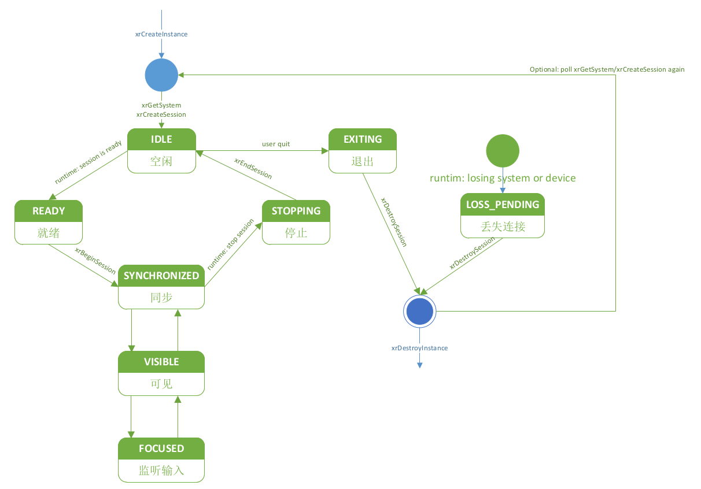

因为渲染流程和Session的生命周期息息相关，所以在进入渲染流程之前，先探讨Session的状态机变化流程。

## 1 Session生命周期


<p align="center"> 图1 Session生命周期 </p>

1、应用程序调用`xrCreateSession`创建一个Session，需要指定参数：System和渲染API，新创建的Session默认状态是 **IDLE**。

2、应用程序通过`XrEventDataSessionStateChanged`监测Session的状态变化。

3、当应用程序准备好呈现XR的内容时，会将Session状态切换到 **READY** 状态，并通知到应用程序。应用程序准备好渲染内容后，需要调用`xrBeginSession`，开始渲染循环。

4、当Session开始运行后，应用程序需要持续执行帧循环，按照以下顺序执行，状态保持一致，和运行时同步。

xrWaitFrame -> xrBeginFrame -> xrEndFrame

一旦运行时和应用程序的帧循环保持了同步，就要开始显示内容了，并将状态切换到：**SYNCHRONIZED**，在这个状态下，提交的帧画面还不会被渲染呈现给用户。

5、当运行时准备显示帧内容时，Session的状态会切换到 **VISIBLE** ，同时设置`xrWaitFrame`中的`XrFrameState::shouldRender`为`true`，此时应用程序渲染XR内容，并在`xrEndFrame`中提交给合成层。

6、当运行时认为应用程序可以接收XR输入事件时（例如手柄、手势等），会通知Session的状态变为 **FOCUSED**，此时应用程序可以接收输入动作信息。

7、当运行时认为应用程序已经失去XR输入焦点时，会将Session状态切为 **VISIBLE**。此时应用程序应该内部状态，停止输入。

8、当用户关闭或跳转至其他应用后，会终止当前运行的Session，状态切换到 **STOPPING**，应用程序接收到此状态，需要停止帧循环，并调用`xrEndSession`来结束Session。

9、当`xrEndSession`执行后，运行时会把状态切换到 **IDLE**，比如Session只是短暂暂停，并在恢复时切换到 **READY**，如果运行时认为Session已经结束了，就会从 **IDLE** 切换到  **EXITING**。

10、应用程接收到**EXITING**事件后，需要调用`xrDestroySession`进行资源释放。可选的是，如果此时重新收到`xrCreateSystem/xrCreateInstance`事件的话，会继续上述1-10的流程。

可以理解为：`xrBeginSession`调用后，Session开始运行，`xrEndSession`后，Session不再运行。有一些接口需要Session运行中才可以使用，否则抛出`XR_ERROR_SESSION_NOT_RUNNING`错误。

## 2 Session流程代码分析

### 2.1 Session创建和回收

为了将渲染内容呈现到XR设备上面，OpenXR应用程序需要选择运行时支持的API。在创建Session的时候，应用程序需要指定渲染API，在`XrSessionCreateInfo`的`next`字段中，类型是`struct XrGraphicsBind*`。

在创建Session前，需要先调用`xrGet*GraphicsRequirements`获取渲染API的要求参数。

比如：`xrGetD3D11GraphicsRequirementsKHR 、xrGetD3D12GraphicsRequirementsKHR 、xrGetOpenGLGraphicsRequirementsKHR 、xrGetVulkanGraphicsRequirementsKHR xrGetVulkanGraphicsRequirements2KHR`

如果调用`xrCreateSession`前，没有调用`xrGet*GraphicsRequirements`，会返回`nXR_ERROR_GRAPHICS_REQUIREMENTS_CALL_MISSING (XR_ERROR_VALIDATION_FAILURE)`错误。

```c++
XrResult xrCreateSession(
  XrInstance instance,
  const XrSessionCreateInfo* createInfo,
  XrSession* session);

typedef struct XrSessionCreateInfo {
  XrStructureType type;
  const void* next;
  XrSessionCreateFlags createFlags;
  XrSystemId systemId;
} XrSessionCreateInfo;

XrResult xrDestroySession(
  XrSession session);
```

创建出来的Session默认是 **IDLE** 状态。

通过调用`xrDestroySession`销毁XrSession句柄，同时XrSession的所有子句柄也会被销毁。应用程序需要保证销毁XrSession后，不再使用。`xrDestroySession`在任何状态下都可以调用。

### 2.2 Session开始和退出

```c++
XrResult xrBeginSession(XrSession session, const XrSessionBeginInfo* beginInfo);

typedef struct XrSessionBeginInfo {
  XrStructureType type;
  const void* next;
  XrViewConfigurationType primaryViewConfigurationType;
} XrSessionBeginInfo;

XrResult xrEndSession(XrSession session);

XrResult xrRequestExitSession(XrSession session);
```

当Session处于 **READY** 状态时，应用程序需要调用xrBeginSession，开始渲染内容。状态变化事件通过`XrEventDataSessionStateChanged`获得。

当`xrBeginSession`调用执行后，我们就认为Session处于运行状态了，应用程序应开始相应的帧循环逻辑，保证`xrWaitFrame/xrBeginFrame/xrEndFrame`按顺序调用。应用程序应按照`xrWaitFrame`返回的`XrFrameState.shouldRender`来判断是否渲染。

当应用程序通过`XrEventDataSessionStateChanged`监听到 **STOPPING** 状态时，应该停止循环处理逻辑，并调用`xrEndSession`来结束运行的Session，`xrEndSession`调用后，应用程序后续处理中，都不应调用`xrWaitFrame/xrBeginFrame/xrEndFrame`了，这样运行时就可以安全的将Session切换到 **IDLE** 状态，同样的，应用程序也应该避免获取输入状态、发送输出事件等。

如果应用程序想要退出正在运行的Session，可以调用`xrRequestExitSession`，此时Session会从 **IDLE** 、 **STOPPING** 状态切换到 **EXITING** 。

Session的各种状态：

```c++
typedef enum XrSessionState {
  XR_SESSION_STATE_UNKNOWN = 0,
  XR_SESSION_STATE_IDLE = 1,
  XR_SESSION_STATE_READY = 2,
  XR_SESSION_STATE_SYNCHRONIZED = 3,
  XR_SESSION_STATE_VISIBLE = 4,
  XR_SESSION_STATE_FOCUSED = 5,
  XR_SESSION_STATE_STOPPING = 6,
  XR_SESSION_STATE_LOSS_PENDING = 7,
  XR_SESSION_STATE_EXITING = 8,
  XR_SESSION_STATE_MAX_ENUM = 0x7FFFFFFF
} XrSessionState;
```

XR_SESSION_STATE_IDLE：调用xrCreateSession或xrEndSession后的状态

XR_SESSION_STATE_READY：应用程序准备调用xrBeginSession，准备进入帧循环

XR_SESSION_STATE_SYNCHRONIZED：应用程序已经同步可帧循环，但还没有呈现给客户

XR_SESSION_STATE_VISIBLE：内容呈现给客户，但不能接收输入

XR_SESSION_STATE_FOCUSED：内容呈现给客户，而且可以接收输入

XR_SESSION_STATE_STOPPING：应用程序应该跳出循环，然后调用`xrEndSession`

XR_SESSION_STATE_LOSS_PENDING：Session已经丢失，应用程序应该销毁当前Session，并考虑重建

 XR_SESSION_STATE_EXITTING：应用程序应停止，并且不能自动重启。

## 3 交换链 Swapchain

XR应用需要把渲染后的图像提交给用户，为了满足此需求，运行时使用交换链来组织图像，用于应用程序的渲染工作。运行时允许应用程序创建多个Swapchain。

交换链图像的支持格式可以通过`xrEnumerateSwapchainFormats`来查询。运行时必须支持`R8G8B8A8`和`R8G8B8A8` `sRGB`，交换链中图像可以是2D或2D数组。

我们假定运行时以线性空间进行渲染，在sRGB空间提交图像，必须使用SRGB格式（DXGI_R8G8B8A8_UNORM_SRGB，GL_SRGB8_ALPHA8，VK_FORMAT_R8B8G8A8_SRGB）来申请图像资源，这样就可以保证运行时读取图像内容时可以自动执行从sRGB到Linear的转换过程。

```c++
XrResult xrEnumerateSwapchainFormats(
  XrSession session,
  uint32_t formatCapacityInput,
  uint32_t* formatCountOutput,
  int64_t* formats);
```

`xrEnumerateSwapchainFormats`查询当前Session支持的纹理格式，具体格式和`xrCreateSession`指定的渲染API有关。

`XrSwapchainUsageFlags`指定Swapchain图像在内部的用途。

```c++

// 图像可以是一个颜色渲染目标
static const XrSwapchainUsageFlags XR_SWAPCHAIN_USAGE_COLOR_ATTACHMENT_BIT = 0x00000001;
// 图像可以是一个深度，模版渲染目标
static const XrSwapchainUsageFlags XR_SWAPCHAIN_USAGE_DEPTH_STENCIL_ATTACHMENT_BIT =
0x00000002;
// 图像可以被无序访问，可能通过原子操作访问
static const XrSwapchainUsageFlags XR_SWAPCHAIN_USAGE_UNORDERED_ACCESS_BIT = 0x00000004;
// 图像可以被用作传输操作的源头
static const XrSwapchainUsageFlags XR_SWAPCHAIN_USAGE_TRANSFER_SRC_BIT = 0x00000008;
// 图像可以被用作传输操作的目标
static const XrSwapchainUsageFlags XR_SWAPCHAIN_USAGE_TRANSFER_DST_BIT = 0x00000010;
// 图像可以用于Shader采样
static const XrSwapchainUsageFlags XR_SWAPCHAIN_USAGE_SAMPLED_BIT = 0x00000020;
// 图像可以被重新解释为其他图像格式
static const XrSwapchainUsageFlags XR_SWAPCHAIN_USAGE_MUTABLE_FORMAT_BIT = 0x00000040;
// 图像将可以用作输入附件。（由XR_MND_swapchain_usage_input_attachment_bit扩展名添加）
static const XrSwapchainUsageFlags XR_SWAPCHAIN_USAGE_INPUT_ATTACHMENT_BIT_MND =
0x00000080;
// 图像可以作输入附件。（由XR_KHR_swapchain_usage_input_attachment_bit扩展名添加）
static const XrSwapchainUsageFlags XR_SWAPCHAIN_USAGE_INPUT_ATTACHMENT_BIT_KHR =
0x00000080; // alias of XR_SWAPCHAIN_USAGE_INPUT_ATTACHMENT_BIT_MND
```

创建Swapchain需要的createInfo

```c++
typedef struct XrSwapchainCreateInfo {
  XrStructureType type;
  const void* next;
  XrSwapchainCreateFlags createFlags;
  XrSwapchainUsageFlags usageFlags;
  int64_t format;
  uint32_t sampleCount;
  uint32_t width;
  uint32_t height;
  uint32_t faceCount; // 如果是立方体贴图就是6，其他情况为1
  uint32_t arraySize; // 图像中层级数量
  uint32_t mipCount;
} XrSwapchainCreateInfo;

// Flag bits for XrSwapchainCreateFlags
// 表示交换链的图像将防止CPU访问，使用Vulkan保护内存等机制进行CPU访问。
static const XrSwapchainCreateFlags XR_SWAPCHAIN_CREATE_PROTECTED_CONTENT_BIT = 0x00000001;
// 表示应用程序将在其整个生命周期内只获取并释放该交换链的一个图像。运行时必须只分配一个交换链图像。
static const XrSwapchainCreateFlags XR_SWAPCHAIN_CREATE_STATIC_IMAGE_BIT = 0x00000002;
```


