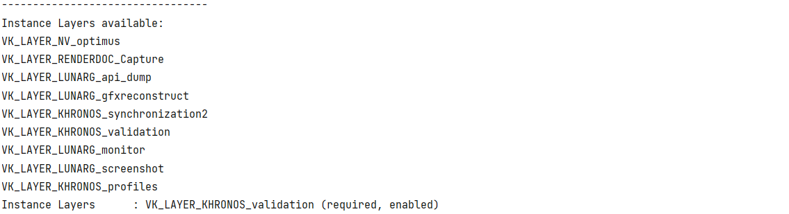
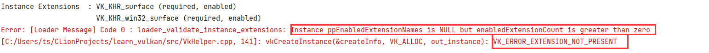
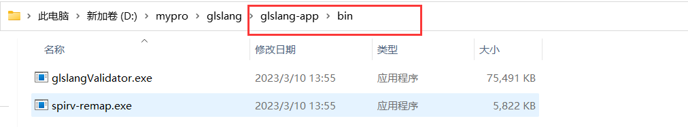
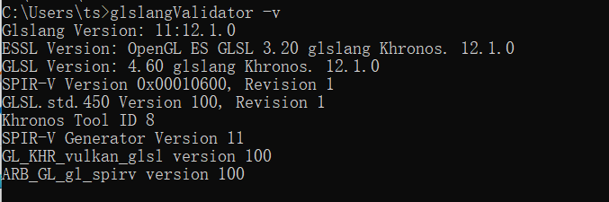

## 1 概述

本文是基于C++和Vulkan的画一个彩色三角形的案例，文中涉及到的内容较多，我尽可能的将不需要地内容剔除，目的是为了梳理出来一个Vulkan程序的基础框架，也是对Vulkan各个对象的初步理解。类似阅读，我们会先从目录中了解书中概要，再循序渐进阅读内容，所以后续文章会继续深挖本文提到的各个对象和流程。

### 1.1 Vulkan的概念

Vulkan是一个渲染图形API，于2015由Khronos组织发布，OpenGL也是这个组织发布的图形API。

官网： https://www.vulkan.org

> Vulkan是一个低开销、跨平台的二维、三维图形与计算的应用程序接口（API），最早由Khronos组织在2015年游戏开发者大会（GDC）上发表。
>
> 来自《维基百科》

| 关键词                 | 说明                                                         |
| ---------------------- | ------------------------------------------------------------ |
| 呈现（present）        | 将渲染结果提交到显示器这一过程，并不是指渲染。               |
| 图像（Image）          | 创建时指定如何使用，可以是color attchment，也就是将渲染结果”画“到这个Image中；也可以是传统贴图，传递给着色器；也可以是读写并用。 |
| 图像视图（Image View） | 图像（Image）不能直接使用，我们将借用图像视图（Image View）来访问像（Image）。 |

### 1.2 为什么是Vulkan

同一个组织，为什么要重新发布一套新的API呢？

- 对于跨系统。OpenGL在安卓应用上其实并不是所有API都支持，而是使用OpenGLES。所以将PC端的代码移植到移动端需要多出很多工作量。但对于Vulkan，全部使用同一套API，在移植时基本上不需要更改很多代码。
- 对于渲染架构。OpenGL中，很多操作是隐式的，其就是一个超大的状态机，通过控制各种状态完成渲染操作。但Vulkan会暴露更多底层细节，比如显卡、内存等。另外，Vulkan中渲染管线、渲染命令等都需要显示控制。总之就是Vulkan比OpenGL要复杂得多，上手难度也大得多，但如果能啃下这个硬骨头，对渲染、Display和显示硬件等知识点能够了解的更深入。
- Vulkan天然支持多线程。OpenGL中，如果数据放到多线程处理，在控制不好的情况下，容易引起冲突，比如在绘制时上传了数据、绑定了贴图等，会造成报错。然而在Vulkan中并没有问题，Vulkan可以使用不同的队列、不同的命令缓冲等，来完成并发、并行渲染。

> 与OpenGL类似，Vulkan针对全平台即时3D图形程序（如电子游戏和交互媒体）而设计，并提供高性能与更均衡的CPU与GPU占用，这也是Direct3D 12和AMD的Mantle的目标。与Direct3D（12版之前）和OpenGL的其他主要区别是，Vulkan是一个底层API，而且能执行并行任务。除此之外，Vulkan还能更好地分配多个CPU核心的使用。
>
> 来自《维基百科》

其实对于OpenGL，本人在两年前也写过几篇文章，地址[点这里](/posts/opengl_renderer/01_%E5%BC%80%E7%AF%87.html)，计划是使用OpenGL来编写一个简单的渲染器。最近准备重启这个项目。但目前因工作需要，只能多了解了解Vulkan，奈何相关资料少之又少，所以准备写本系列文章。如果读者没有OpenGL的基础，非常建议直接学习Vulkan，虽然OpenGL对初学者相对良好，但其他很多内容，比如渲染流程、渲染管线、多重采样等原理两者都是一样的。

## 2 方案

### 2.1 目标

在这里，我们的目标非常“简单”，那就是使用Vulkan绘制出来一个最简单的彩色三角形。对于图形渲染来说，三角形跟我们刚学程序时的“Hello World”一样拥有重大意义。不过，使用OpenGL可以用差不多100行代码绘制出来一个三角形，Vulkan却大概需要1000行代码，所以本片的篇幅将会比较长。

### 2.2 重要对象简要认识

本着是“Hello World”的原则，在这三角形案例中，我将尽可能的减少对象和减少代码量，重要的初步了解到Vulkan程序的基本框架和写法。所以，这篇文章中将会出现以下几个对象：

> 如果这些名词和作用不太理解，可以直接跳到实现的那个章节，后续再反复理解即可。

- **物理设备（Physical Device）**，对于大多数系统来说，物理设备也就是GPU
- **队列族（Queue Family）**，队列族是找出合适的物理设备使用。因为有的队列适合提交图形渲染命令，也有的队列适合提交计算命令，所以需要通过队列族来区分。
- **逻辑设备（Device）**，可以理解为物理设备的一个引用，也就是一个逻辑操作对象。大部分的Vulkan API操作都是使用逻辑设备，而不是物理设备。
- **队列（Queue）**，根据队列族找到合适的物理设备后，创建逻辑设备前，需要指定要创建的队列数量，就可以获取到相应队列。队列是用来提交一个个命令缓冲的。加入是多线程应用，就可以将命令缓冲提交到不同队列，以完成高效渲染。
- **窗口表面（Surface）**，因为作跨系统所用，在窗口级别上加一层中间层，所有Vulkan API使用这个对象既可完成对窗口的各种操作。
- **交换链（Swapchain）**，可以理解为是一个图像队列，是将图像提交到屏幕的基本机制。应用程序从交换链获取图像并执行绘制，完成后重新提交给交换链并完成图像呈现。
- **命令池（Command Pool）**，各种内存操作、绑定、绘制等命令都需要记录到命令缓冲并提交到队列，所以这里需要很多命令缓冲，命令池就是为了加快命令的使用效率。
- **渲染流程（Render Pass）**，渲染中的颜色附件、深度附件、模板附件等在此指定。
- **图形渲染管线（Pipeline）**，在Vulkan中，图形渲染管线需要显式指定，包括顶点、光栅化、多重采样、深度缓冲、模块缓冲等流程定义。
- **命令缓冲（Command Buffer）**，用作记录各种命令，然后统一提交到队列中。
- **帧缓冲（Frame Buffer）**，表示各种附件的集合，包括颜色附件、深度附件、模板附件等等。
- **信号量（Semaphore）**，用作CPU和GPU之间同步，CPU需要等待GPU执行完毕才可以继续执行提交或呈现。

### 2.3 步骤

1. 选取合适的物理设备
2. 创建逻辑设备
3. 创建窗口表面
4. 创建交换链
5. 创建命令池
6. 创建渲染流程
7. 创建图形渲染管线
8. 创建n个命令缓冲，我们先只创建1个
9. 创建n个帧缓冲，我们先只创建1个
10. 创建n个信号量，我们先只创建1个
11. 渲染主循环
    1. 从交换链中获取图像索引（使用到信号量）
    2. 绑定渲染流程
    3. 绑定命令缓冲
    4. 执行渲染
    5. 结束命令缓冲
    6. 结束渲染流程
    7. 将命令缓冲提交到队列
    8. 将队列内容呈现
12. 结束

## 3 实现

**版本约定**：

| 事项     | 作用               | 版本号         | 备注                       |
| -------- | ------------------ | -------------- | -------------------------- |
| 操作系统 | 编程和程序运行环境 | Windows7/10/11 | 代码编写环境为Windows11    |
| C/C++    | 编程语言           | 17             | set(CMAKE_CXX_STANDARD 17) |
| CMake    | 构建项目           | 3.26.0-rc5     | `cmake --version`命令查询  |
| GLFW     | 窗口系统           | 3.3.8          |                            |
| 代码风格 | 统一风格           | 小驼峰         |                            |

说明：这篇文章**不包括**C++环境搭建、Vulkan的下载安装，如有需要可以参考【[Lean-Vulkan_环境准备](/posts/learn-vulkan/lean-vulkan_环境准备.html)】。

**编写技巧**

在Vulkan API中，大部分遵循以下几种风格（VkXxx代表对象名，比如VKInstance，VkDevice，VkFramebuffer等）。

1. 创建和销毁对象。

```c++
//创建
VkXxxCreateInfo createInfo{};
if(VK_SUCCESS != vkCreateXxx(&createInfo, nullptr, &xxx)){
    Error("Failed to create xxx.");
}
//销毁
vkDestroyXxx(xxx, nullptr);
```

2. 枚举属性列表。

```c++
uint32_t xxxCount;
vkEnumerateXxx(&xxxCount, nullptr);
VkXxx xxxArr[xxxCount];
vkEnumerateXxx(&xxxCount, xxxArr);
```

3. 内存申请和释放。

```c++
//申请内存
VkMemoryAllocateInfo memAllocateInfo = {
        .sType = VK_STRUCTURE_TYPE_MEMORY_ALLOCATE_INFO,
        .allocationSize = n,
        .memoryTypeIndex = index
};
vkAllocateMemory(device, &memAllocateInfo, nullptr, &xxxMemo));

//释放内存
vkFreeMemory(vk.device, &xxxMemo, nullptr);
```

4. 有Begin就会有End。

```c++
vkBeginXxx();
...
...
vkEndXxx();
```

**主要的源代码文件**

在实现之前，我们创建一个结构体用来存储各个Vulkan对象，再使用一个静态工具实现各个Vulkan对象的创建和销毁。

```c++
struct VkBundle {
	VkInstance instance;
    ...
    ...
};
```

```c++
class VkHelper {
     /** create Vulkan Instance */
    static void createInstance(bool bValidate, VkInstance *out_instance, VkDebugReportCallbackEXT *out_debugReport)
    ...
    ...
}
```

主流程代码。

```c++
void init(){
    ...
    ...
}

void renderLoop(){
    uint32_t currentFrame = 0;
    while(!glfwWindowShouldClose(window)){
        glfwPollEvents();

        render(currentFrame);

        glfwSwapBuffers(window);
        currentFrame = (currentFrame + 1) % vk.maxFrameCount;
        std::this_thread::sleep_for(std::chrono::milliseconds(1));
    }
}

void destroy(){
    Print("%s", __FUNCTION__);
    vkDeviceWaitIdle(vk.device)
        
    vkDestroyXxx(...);
    ...
    ...
}

int main() {
    std::cout << "Hello, Learn Vulkan!" << std::endl;

    init();
    renderLoop();
    destroy();

    return 0;
}
```


### 3.1 Vulkan实例

使用Vulkan作为图形API之前，需要创建一个唯一的VkInstance，一般一个应用程序只会有一个VkInstance。

创建VkInstance的三个步骤：

1. 检查层Layer支持列表；
2. 检查扩展Extension支持列表；
3. 调用vkCreateXxx()函数。

我们在`VkHelper`中创建`createInstance()`函数，并使用`vkEnumerateInstanceLayerProperties()`枚举出来目前环境支持的所有层列表，在这些层列表中检查我们需要用到的层。目前用到的一个层是Vulkan validation，在后续调用API过程中，如果出现错误需要使用到改层实现错误检查和输出。因为后续还需要检查设备层、设备扩展等，所以我们抽取出一个专用的检查功能函数。

我们添加一个结构体，用来记录要验证的层或扩展。

```c++
typedef struct
{
    const char      *name;
    bool			validationOnly;
    bool			required;
} DriverFeature;
```

接下来添加一个验证函数。

```c++

/**
 * 层/扩展验证
 * @param label 提示名，用作日志输出使用
 * @param validationEnabled 是否启用验证，如果为否，直接跳过
 * @param extensions 是否属于扩展验证，层验证时为false，扩展验证时为true
 * @param requested 待验证列表
 * @param requestedCount 待验证数量
 * @param available 全部的功能列表，从vkEnumerateXxxLayerProperties或vkEnumerateXxxExtensionProperties获取
 * @param availableCount 全部功能数量
 * @param enabledNames 输出的可用功能名称数组
 * @param enabledCount 输出的可用功能数量
 * @return 操作是否成功
 */
bool checkFeatures(const char *label, const bool validationEnabled, const bool extensions,
                   const DriverFeature *requested, const uint32_t requestedCount,
                   const void *available, const uint32_t availableCount,
                   const char *enabledNames[], uint32_t *enabledCount){

#ifdef M_DEBUG
    Print("%s available: ", label);
    for(int i = 0; i < availableCount; i++){
        const char * name = extensions ? ((const VkExtensionProperties *)available)[i].extensionName : ((const VkLayerProperties *)available)[i].layerName;
        Print("%s", name);
    }
#endif
    bool foundAllRequired = true;
    *enabledCount = 0;
    for ( uint32_t i = 0; i < requestedCount; i++ )
    {
        bool found = false;
        const char *result = requested[i].required ? "(required, not found)" : "(not found)";
        for ( uint32_t j = 0; j < availableCount; j++ )
        {
            const char * name = extensions ? ((const VkExtensionProperties *)available)[j].extensionName :
                                ((const VkLayerProperties *)available)[j].layerName;
            if ( strcmp( requested[i].name, name ) == 0 )
            {
                found = true;
                if ( requested[i].validationOnly && !validationEnabled )
                {
                    result = "(not enabled)";
                    break;
                }
                enabledNames[(*enabledCount)++] = requested[i].name;
                result = requested[i].required ? "(required, enabled)" : "(enabled)";
                break;
            }
        }
        foundAllRequired &= ( found || !requested[i].required );
        Print( "%-21s%c %s %s", ( i == 0 ? label : "" ), ( i == 0 ? ':' : ' ' ), requested[i].name, result );
    }
    return foundAllRequired;
}
```

另外，以下公共的处理和判断，我们抽取到一个[头文件VulkanCommon.h](https://gitee.com/xingchen0085/learn_vulkan/blob/master/src/VulkanCommon.h)中。

现在我们开始使用验证函数，从第一步开始，验证Vulkan实例的层功能、扩展列表。

**层验证**

在这个案例中，我们只使用一个层：API验证。

```c++
const DriverFeature validation_layers[] = {
        {"VK_LAYER_KHRONOS_validation",    false,     true}
};
```

枚举查询和验证

```c++
//instance layers
uint32_t availableLayerCount;
CALL_VK(vkEnumerateInstanceLayerProperties(&availableLayerCount, nullptr));
VkLayerProperties availableLayerProps[availableLayerCount];
CALL_VK(vkEnumerateInstanceLayerProperties(&availableLayerCount, availableLayerProps));
Print("---------------------------------");
const char *enabledLayerNames[32] = {};
uint32_t enabledLayerCount = 0;
checkFeatures("Instance Layers", bValidate, false, validation_layers, ARRAY_SIZE(validation_layers),
              availableLayerProps, availableLayerCount, enabledLayerNames, &enabledLayerCount);
```

结果输出（不同硬件环境结果可能略有不同）。



**扩展验证**

```c++
const DriverFeature validation_extensions[] = {
        {"VK_KHR_surface",    false,     true},
        {"VK_KHR_win32_surface",    false,     true}
};
```

- VK_KHR_surface 窗口表面支持。
- VK_KHR_win32_surface 针对Win32的窗口表面支持，如果是其他操作系统，这里需要变更。

对于扩展验证也是类似的。

```c++
//instance extensions
uint32_t availableExtensionCount;
CALL_VK(vkEnumerateInstanceExtensionProperties(nullptr, &availableExtensionCount, nullptr));
VkExtensionProperties availableExtensionProps[availableExtensionCount];
CALL_VK(vkEnumerateInstanceExtensionProperties(nullptr, &availableExtensionCount, availableExtensionProps));
Print("---------------------------------");
const char *enableExtensionNames[32] = {};
uint32_t enableExtensionCount = 0;
checkFeatures("Instance Extensions", bValidate, true, validation_extensions, ARRAY_SIZE(validation_extensions),
              availableExtensionProps, availableExtensionCount, enableExtensionNames, &enableExtensionCount);

```

我们获得的是最终的层和扩展：enabledLayerNames，enabledLayerCount，enableExtensionNames，enableExtensionCount。在接下来的VkInstance的创建中，我们将首次见到上文提到的代码风格。

**创建VkInstance**

```c++
VkInstanceCreateInfo createInfo = {
        .sType = VK_STRUCTURE_TYPE_INSTANCE_CREATE_INFO,
        .pNext = nullptr,
        .flags = 0,
        .pApplicationInfo = nullptr,
        .enabledLayerCount = enabledLayerCount,
        .ppEnabledLayerNames = enabledLayerCount == 0 ? nullptr : enabledLayerNames,
        .enabledExtensionCount = enableExtensionCount,
        .ppEnabledExtensionNames = enableExtensionCount == 0 ? nullptr : enableExtensionNames
};
CALL_VK(vkCreateInstance(&createInfo, VK_ALLOC, out_instance));
```

我们定义好了这一框架之后，发现有一个成员变量还需要赋值：`pApplicationInfo`，从`VkInstanceCreateInfo`结构体可知，我们需要一个`VkApplicationInfo`对象指针，因此我们也需要初始化。

```c++
VkApplicationInfo application = {
        .sType = VK_STRUCTURE_TYPE_APPLICATION_INFO,
        .pNext = nullptr,
        .pApplicationName = APP_NAME,
        .applicationVersion = VK_MAKE_VERSION(1, 0, 0),
        .pEngineName = APP_NAME,
        .engineVersion = VK_MAKE_VERSION(1, 0, 0),
        .apiVersion = VK_VERSION_1_0
};
```

这是在创建VkInstance需要指定的一些App信息，包括版本号指定、应用名称等。

如此一来，我们将`application`赋值给`pApplicationInfo`即可。

```c++
VkInstanceCreateInfo createInfo = {
        .sType = VK_STRUCTURE_TYPE_INSTANCE_CREATE_INFO,
        .pNext = nullptr,
        .flags = 0,
        .pApplicationInfo = &application,
        .enabledLayerCount = enabledLayerCount,
        .ppEnabledLayerNames = enabledLayerCount == 0 ? nullptr : enabledLayerNames,
        .enabledExtensionCount = enableExtensionCount,
        .ppEnabledExtensionNames = enableExtensionCount == 0 ? nullptr : enableExtensionNames
};
```

**添加验证层配置**

还记得我们之前定义的`validation_layers`吗？如果需要Vulkan报告API调用中的错误，就需要添加一个错误回调。

```c++
VkBool32 debugReportCallback(VkDebugReportFlagsEXT msgFlags, VkDebugReportObjectTypeEXT objType, uint64_t srcObject, size_t location, int32_t msgCode, const char *pLayerPrefix, const char *pMsg, void *pUserData){
    if(msgFlags == VK_DEBUG_REPORT_ERROR_BIT_EXT){
        Error("%s: [%s] Code %d : %s", "Error", pLayerPrefix, msgCode, pMsg);
    } else if(msgFlags == VK_DEBUG_REPORT_WARNING_BIT_EXT) {
        Warn("%s: [%s] Code %d : %s", "Warning", pLayerPrefix, msgCode, pMsg);
    } else {
        Print("%s: [%s] Code %d : %s", "Info", pLayerPrefix, msgCode, pMsg);
    }
    return VK_FALSE;
}
```

另外，在上文中执行`vkCreateInstance()`之前，创建`VkDebugReportCallbackCreateInfoEXT`并赋值到`pNext`成员变量上，我们的验证层即可使用。

```c++
VkInstanceCreateInfo createInfo = {
	...
    ...
};

//在创建VkInstance之前
if(bValidate){
    VkDebugReportCallbackCreateInfoEXT debugReport = {
        .sType = VK_STRUCTURE_TYPE_DEBUG_REPORT_CALLBACK_CREATE_INFO_EXT,
        .pNext = nullptr,
        .flags = VK_DEBUG_REPORT_ERROR_BIT_EXT |				//错误信息
                 VK_DEBUG_REPORT_WARNING_BIT_EXT |				//警告信息
                 VK_DEBUG_REPORT_PERFORMANCE_WARNING_BIT_EXT,	//性能警告信息
        .pfnCallback = (PFN_vkDebugReportCallbackEXT) debugReportCallback,
        .pUserData = nullptr,
    };
    
    createInfo.pNext = &debugReport;
}

CALL_VK(vkCreateInstance(&createInfo, VK_ALLOC, out_instance));
```

**使用和销毁**

在`init()`中调用创建函数，并在`destroy()`中回收。

```c++
struct VkBundle {
    VkInstance instance;
    VkDebugReportCallbackEXT debugReport;
}

VkBundle vk;

void init(){
    VkHelper::createInstance(true, &vk.instance, &vk.debugReport);
}

...
...
void destroy(){
    Print("%s", __FUNCTION__);
    vkDeviceWaitIdle(vk.device);
    vkDestroyInstance(vk.instance, VK_ALLOC);
}
```

此时我们可以测试VkInstance是否创建成功。如果没有错误日志而且out_instance指针不为空，则表示程序运行正常。我们也可以测试一下验证层是否成果，比如在`VkInstanceCreateInfo`中将`ppEnabledExtensionNames`置为nullptr。

```c++
VkInstanceCreateInfo createInfo = {
            .sType = VK_STRUCTURE_TYPE_INSTANCE_CREATE_INFO,
            .pNext = nullptr,
            .flags = 0,
            .pApplicationInfo = &application,
            .enabledLayerCount = enabledLayerCount,
            .ppEnabledLayerNames = enabledLayerCount == 0 ? nullptr : enabledLayerNames,
            .enabledExtensionCount = enableExtensionCount,
    		// 更改这里，可以测试验证层是否成功。
            .ppEnabledExtensionNames = nullptr, //enableExtensionCount == 0 ? nullptr : enableExtensionNames
    };
...
...
```

如果验证层已经成功，将看到以下错误信息。



### 3.2 窗口表面

在`VkBundle`中添加`surface`成员变量存储窗口表面对象。

```c++
struct VkBundle {
    VkInstance instance;
    VkDebugReportCallbackEXT debugReport;

    VkSurfaceKHR surface;
}
```

利用GLFW实现窗口创建和Surface创建。

```c++
#define WINDOW_WIDTH 800
#define WINDOW_HEIGHT 600
GLFWwindow *window;

void createWindow(){
    if(!glfwInit()){
        throw std::runtime_error("Can not init glfw window.");
    }
    glfwWindowHint(GLFW_CLIENT_API, GLFW_NO_API);
    window = glfwCreateWindow(WINDOW_WIDTH, WINDOW_HEIGHT, APP_NAME, nullptr, nullptr);
    if(!window){
        throw std::runtime_error("Can not create glfw window");
    }

    Print("GLFW Vulkan Support: %d", glfwVulkanSupported());
    glfwMakeContextCurrent(window);

    if(glfwCreateWindowSurface(vk.instance, window, VK_ALLOC, &vk.surface) != VK_SUCCESS){
        throw std::runtime_error("Can not creat surface.");
    }

    Print("surface: %p", vk.surface);
}
```

在`init()`中执行Window的创建。

```c++
void init(){
    VkHelper::createInstance(true, &vk.instance, &vk.debugReport);
    createWindow();
}
```

在`destroy()`中销毁surface，并终止GLFW的窗口运行。

```c++
void destroy(){
    Print("%s", __FUNCTION__);
    vkDeviceWaitIdle(vk.device);
    vkDestroySurfaceKHR(vk.instance, vk.surface, VK_ALLOC);
    vkDestroyInstance(vk.instance, VK_ALLOC);
    glfwDestroyWindow(window);
    glfwTerminate();
}
```

### 3.3 逻辑设备

在`VkBundle`中添加device和queue的成员变量。

```c++
struct DeviceInfo {
    VkPhysicalDevice physicalDev;
    VkPhysicalDeviceLimits physicalDevLimits;
    VkPhysicalDeviceMemoryProperties physicalDevMemoProps;
    VkDevice device;
};

struct QueueInfo {
    uint16_t workQueueIndex;
    uint16_t presentQueueIndex;
    VkQueue queue;
};

struct VkBundle {
    ...
    ...
    struct DeviceInfo deviceInfo;
    struct QueueInfo queueInfo;
}
```

在`VkHelper`中添加`pickPhyDevAndCreateDev()`函数。

```c++
void VkHelper::pickPhyDevAndCreateDev(VkInstance instance, VkSurfaceKHR surface, DeviceInfo *out_deviceInfo, QueueInfo *out_queueInfo) {}
```

创建逻辑设备的步骤：

1. 枚举出来所有的物理设备；
2. 遍历所有物理设备，找到支持窗口表面的设备，并且判断队列族是否是图形队列（因为我们这个案例需要用图形渲染管线渲染），如果符合，将队列索引记录下来，备用；
3. 查询物理设备的限量、内存属性并赋值，后续内存操作时使用；
4. 查询设备支持扩展列表并验证；
5. 创建逻辑设备；
6. 从逻辑设备获取已创建的队列并赋值给`VkBundle`备用。

**选取合适的物理设备**

枚举出来索引的物理设备。

```c++
uint32_t physicalDevCount;
CALL_VK(vkEnumeratePhysicalDevices(instance, &physicalDevCount, nullptr));
VkPhysicalDevice physicalDevs[physicalDevCount];
CALL_VK(vkEnumeratePhysicalDevices(instance, &physicalDevCount, physicalDevs));
```

```c++
Print("---------------------------------");
Print("Physical Devices:");

//选取的物理设备和队列索引
VkPhysicalDevice selectedPhysicalDev = nullptr;
uint16_t workQueueIndex;
uint16_t presentQueueIndex;

for(int i = 0; i < physicalDevCount; i++){
    VkPhysicalDeviceProperties devProps;
    vkGetPhysicalDeviceProperties(physicalDevs[i], &devProps);
    
    /****************** For log *********************/
    const uint32_t driverMajor = VK_VERSION_MAJOR(devProps.driverVersion);
    const uint32_t driverMinor = VK_VERSION_MINOR(devProps.driverVersion);
    const uint32_t driverPatch = VK_VERSION_PATCH(devProps.driverVersion);

    const uint32_t apiMajor = VK_VERSION_MAJOR(devProps.apiVersion);
    const uint32_t apiMinor = VK_VERSION_MINOR(devProps.apiVersion);
    const uint32_t apiPatch = VK_VERSION_PATCH(devProps.apiVersion);

    Print("---------------------------------" );
    Print("Device Name          : %s", devProps.deviceName);
    Print("Device Type          : %s",	
        ((devProps.deviceType == VK_PHYSICAL_DEVICE_TYPE_INTEGRATED_GPU) ? "integrated GPU" :
		((devProps.deviceType == VK_PHYSICAL_DEVICE_TYPE_DISCRETE_GPU) ? "discrete GPU" :
		((devProps.deviceType == VK_PHYSICAL_DEVICE_TYPE_VIRTUAL_GPU) ? "virtual GPU" :
		((devProps.deviceType == VK_PHYSICAL_DEVICE_TYPE_CPU) ? "CPU" : "unknown")))));
    Print("Vendor ID            : 0x%04X", devProps.vendorID);
    Print("Device ID            : 0x%04X", devProps.deviceID);
    Print("Driver Version       : %d.%d.%d", driverMajor, driverMinor, driverPatch);
    Print("API Version          : %d.%d.%d", apiMajor, apiMinor, apiPatch);
    /****************** For log *********************/
    
    uint32_t queueFamilyPropCount;
    vkGetPhysicalDeviceQueueFamilyProperties(physicalDevs[i], &queueFamilyPropCount, nullptr);
    VkQueueFamilyProperties queueFamilyProps[queueFamilyPropCount];
    vkGetPhysicalDeviceQueueFamilyProperties(physicalDevs[i], &queueFamilyPropCount, queueFamilyProps);
    //表面查询支持
    for(int j = 0; j < queueFamilyPropCount; j++){
        VkBool32 surfaceSupport;
        vkGetPhysicalDeviceSurfaceSupportKHR(physicalDevs[i], i, surface, &surfaceSupport);
        Print("Surface Support: %d", surfaceSupport);

        if(surfaceSupport && queueFamilyProps[j].queueFlags & VK_QUEUE_GRAPHICS_BIT) {
            selectedPhysicalDev = physicalDevs[i];
            workQueueIndex = j;
            presentQueueIndex = j;
            break;
        }
    }
}
if(nullptr == selectedPhysicalDev){
    throw std::runtime_error("Can not find any suitable Physical device.");
}
```

**物理设备属性**

```c++
VkPhysicalDeviceProperties devProps;
vkGetPhysicalDeviceProperties(selectedPhysicalDev, &devProps);
out_deviceInfo->physicalDev = selectedPhysicalDev;
out_deviceInfo->physicalDevLimits = devProps.limits;
out_queueInfo->workQueueIndex = workQueueIndex;
out_queueInfo->presentQueueIndex = presentQueueIndex;
vkGetPhysicalDeviceMemoryProperties(selectedPhysicalDev, &out_deviceInfo->physicalDevMemoProps);
```

**验证设备扩展，是否支持交换链。**

```c++
const DriverFeature validation_device_extensions[] = {
        {VK_KHR_SWAPCHAIN_EXTENSION_NAME, false, true}
};
```

```c++
uint32_t availableDeviceExtensionCount;
CALL_VK(vkEnumerateDeviceExtensionProperties(out_deviceInfo->physicalDev, nullptr, &availableDeviceExtensionCount, nullptr));
VkExtensionProperties availableDeviceExtensions[availableDeviceExtensionCount];
CALL_VK(vkEnumerateDeviceExtensionProperties(out_deviceInfo->physicalDev, nullptr, &availableDeviceExtensionCount, availableDeviceExtensions));
const char *enableDeviceExtensions[32];
uint32_t enableDeviceExtensionCount;
checkFeatures("Device Extensions", true, true, validation_device_extensions, ARRAY_SIZE(validation_device_extensions),
              availableDeviceExtensions, availableDeviceExtensionCount, enableDeviceExtensions, &enableDeviceExtensionCount);

```

**队列信息**

我们暂时只创建一个队列，以作最简单的演示。

```c++
float queuePriority = 1.0f;
VkDeviceQueueCreateInfo queueCreateInfo = {
        .sType = VK_STRUCTURE_TYPE_DEVICE_QUEUE_CREATE_INFO,
        .pNext = nullptr,
        .flags = 0,
        .queueFamilyIndex = out_queueInfo->workQueueIndex,
        .queueCount = 1,
        .pQueuePriorities = &queuePriority, //队列优先级
};
```

**创建逻辑设备**

```c++
VkDeviceCreateInfo deviceCreateInfo = {
    .sType = VK_STRUCTURE_TYPE_DEVICE_CREATE_INFO,
    .pNext = nullptr,
    .flags = 0,
    .queueCreateInfoCount = 1,
    .pQueueCreateInfos = &queueCreateInfo,
    .enabledLayerCount = 0,
    .ppEnabledLayerNames = nullptr,
    .enabledExtensionCount = enableDeviceExtensionCount,
    .ppEnabledExtensionNames = enableDeviceExtensionCount == 0 ? nullptr : enableDeviceExtensions
};
CALL_VK(vkCreateDevice(out_deviceInfo->physicalDev, &deviceCreateInfo, VK_ALLOC, &out_deviceInfo->device));
```

**获取队列**

```c++
vkGetDeviceQueue(out_deviceInfo->device, out_queueInfo->workQueueIndex, 0, &out_queueInfo->queue);
```

`pickPhyDevAndCreateDev()`实现完成后，同样是在`init()`中调用，并在`destroy()`中销毁。

```c++
void init(){
    ...
    ...
    createWindow();
    VkHelper::pickPhyDevAndCreateDev(vk.instance, vk.surface, &vk.deviceInfo, &vk.queueInfo);
}
```

```c++
void destroy(){
    ...
    ...
    vkDestroyDevice(vk.deviceInfo.device, VK_ALLOC);
    vkDestroySurfaceKHR(vk.instance, vk.surface, VK_ALLOC);
    ...
    ...
}
```

### 3.4 命令池

后续所有命令操作都要从命令池中获取命令并执行，所以我们先创建一个备用。

```c++
struct VkBundle {
    ...
    ...
	VkCommandPool cmdPool;
}
```

命令池的创建相对简单，只需要指定队列索引即可创建。

```c++
void VkHelper::createCommandPool(VkDevice device, uint32_t workQueueIndex, VkCommandPool *out_cmdPool) {
 	VkCommandPoolCreateInfo createInfo = {
        .sType = VK_STRUCTURE_TYPE_COMMAND_POOL_CREATE_INFO,
        .pNext = nullptr,
        .flags = VK_COMMAND_POOL_CREATE_RESET_COMMAND_BUFFER_BIT,
        .queueFamilyIndex = workQueueIndex
    };
    CALL_VK(vkCreateCommandPool(device, &createInfo, VK_ALLOC, out_cmdPool));
}
```

在`init()`中使用。

```c++
VkHelper::createCommandPool(vk.deviceInfo.device, vk.queueInfo.workQueueIndex, &vk.cmdPool);
```

在`destroy()`中销毁。

```c++
void destroy(){
    ...
    ...
	vkDestroyCommandPool(vk.deviceInfo.device, vk.cmdPool, VK_ALLOC);
    vkDestroyDevice(vk.deviceInfo.device, VK_ALLOC);
    ...
    ...
}
```

### 3.5 交换链

创建交换链的步骤：

1. 查询表面参数；
   - 功能；
   - 格式；
   - 呈现模式。
2. 创建交换链。

我们创建一个保存表面参数的结构体，名为`SwapchainParam`。

```c++
struct SwapchainParam{
    VkSurfaceCapabilitiesKHR capabilities;	//功能
    VkSurfaceFormatKHR format;				//格式
    VkPresentModeKHR presentMode;			//呈现模式
    VkExtent2D extent;						//范围
};
```

接下来创建一个`createSwapchain()`函数。

```c++
void VkHelper::createSwapchain(VkPhysicalDevice physicalDev, VkDevice device, VkSurfaceKHR surface,
                               uint16_t workQueueIndex, uint16_t presentQueueIndex,
                               SwapchainParam *out_swapchainParam, VkSwapchainKHR *out_swapchain){}
```

在函数中实现上述两个步骤，首先查询表面参数。

```c++
void querySwapchainParam(VkPhysicalDevice physicalDev, VkSurfaceKHR surface, SwapchainParam *out_swapchainParam){
	//capabilities
    CALL_VK(vkGetPhysicalDeviceSurfaceCapabilitiesKHR(physicalDev, surface, &out_swapchainParam->capabilities));
    out_swapchainParam->extent = out_swapchainParam->capabilities.currentExtent;
    Print("Extent: %d, %d", out_swapchainParam->extent.width, out_swapchainParam->extent.height);
    
    //format
    uint32_t formatCount;
    vkGetPhysicalDeviceSurfaceFormatsKHR(physicalDev, surface, &formatCount, nullptr);
    VkSurfaceFormatKHR formats[formatCount];
    vkGetPhysicalDeviceSurfaceFormatsKHR(physicalDev, surface, &formatCount, formats);
    bool bFindFormat = false;
    if(formatCount == 1 && formats[0].format == VK_FORMAT_UNDEFINED){
        out_swapchainParam->format = {VK_FORMAT_B8G8R8A8_UNORM,   VK_COLORSPACE_SRGB_NONLINEAR_KHR};
        bFindFormat = true;
    }  else {
        for (const auto &item: formats) {
            if(item.format == VK_FORMAT_B8G8R8A8_UNORM && item.colorSpace == VK_COLORSPACE_SRGB_NONLINEAR_KHR){
                out_swapchainParam->format = item;
                bFindFormat = true;
                break;
            }
        }
    }
    if(!bFindFormat){
        out_swapchainParam->format = formats[0];
    }
    
    //present mode
    uint32_t presentModeCount;
    vkGetPhysicalDeviceSurfacePresentModesKHR(physicalDev, surface, &presentModeCount, nullptr);
    VkPresentModeKHR presentModes[presentModeCount];
    vkGetPhysicalDeviceSurfacePresentModesKHR(physicalDev, surface, &presentModeCount, presentModes);

    //VK_PRESENT_MODE_IMMEDIATE_KHR 立即提交，可能导致画面撕裂
    //VK_PRESENT_MODE_FIFO_KHR 先进先出的队列，队列满时需要等待，类似垂直同步
    //VK_PRESENT_MODE_FIFO_RELAXED_KHR 和上一模式的区别是：如果应用程序延迟，导致交换链的队列在上一次垂直回扫时为空， 那么，如果应用程序在下一次垂直回扫前提交图像，图像会立即被显示。这一模式可能会导致撕裂现象。
    //VK_PRESENT_MODE_MAILBOX_KHR 这一模式是第二种模式的另一个变种。它不会在交换链的队列满时阻塞应用程序，队列中的图像会被直接替换为应用程序新提交的图像。这一模式可以用来实现三倍缓冲，避免撕裂现象的同时减小了延迟问题
    bool bFoundPrentMode = false;
    for (const auto &item: presentModes) {
        if(VK_PRESENT_MODE_MAILBOX_KHR == item){
            out_swapchainParam->presentMode = item;
            bFoundPrentMode = true;
        } else if(VK_PRESENT_MODE_IMMEDIATE_KHR == item){ //目前大部分硬件不不支持VK_PRESENT_MODE_MAILBOX_KHR
            out_swapchainParam->presentMode = item;
            bFoundPrentMode = true;
        }
    }
    if(!bFoundPrentMode){
        out_swapchainParam->presentMode = VK_PRESENT_MODE_MAILBOX_KHR;
    }
}
```

```c++
void VkHelper::createSwapchain(VkPhysicalDevice physicalDev, VkDevice device, VkSurfaceKHR surface,
                               uint16_t workQueueIndex, uint16_t presentQueueIndex,
                               SwapchainParam *out_swapchainParam, VkSwapchainKHR *out_swapchain){
    querySwapchainParam(physicalDev, surface, out_swapchainParam);
    ...
    ...
}
```

然后就是执行`vkCreateSwapchain()`，和其他对象类似地创建swapchain。

```c++
void VkHelper::createSwapchain(VkPhysicalDevice physicalDev, VkDevice device, VkSurfaceKHR surface,
                               uint16_t workQueueIndex, uint16_t presentQueueIndex,
                               SwapchainParam *out_swapchainParam, VkSwapchainKHR *out_swapchain){

    querySwapchainParam(physicalDev, surface, out_swapchainParam);
    
    ...
    ...
    VkSwapchainCreateInfoKHR swapchainCreateInfo = {
        //TODO
    }; 
    CALL_VK(vkCreateSwapchainKHR(device, &swapchainCreateInfo, VK_ALLOC, out_swapchain));
```

现在的核心就是构造`swapchainCreateInfo`对象。

```c++
uint32_t queueFamilysArr[2] = {static_cast<uint32_t>(workQueueIndex), static_cast<uint32_t>(presentQueueIndex)};

VkSwapchainKHR oldSwapchain;
if(nullptr != out_swapchain && VK_NULL_HANDLE != *out_swapchain){
    oldSwapchain = *out_swapchain;
}

VkSwapchainCreateInfoKHR swapchainCreateInfo = {
            .sType = VK_STRUCTURE_TYPE_SWAPCHAIN_CREATE_INFO_KHR,
            .pNext = nullptr,
            .flags = 0,
    		//上文创建的窗口表面
            .surface = surface,
            .minImageCount = out_swapchainParam->capabilities.minImageCount,
            .imageFormat = out_swapchainParam->format.format,
            .imageColorSpace = out_swapchainParam->format.colorSpace,
            .imageExtent = out_swapchainParam->extent,
            .imageArrayLayers = 1,
    		//用为颜色附件
            .imageUsage = VK_IMAGE_USAGE_COLOR_ATTACHMENT_BIT,
            .imageSharingMode = workQueueIndex == presentQueueIndex ? VK_SHARING_MODE_EXCLUSIVE : VK_SHARING_MODE_CONCURRENT,
            .queueFamilyIndexCount = static_cast<uint32_t>(workQueueIndex == presentQueueIndex ? 1 : 2),
            .pQueueFamilyIndices = workQueueIndex == presentQueueIndex ? nullptr : queueFamilysArr,
            .preTransform = out_swapchainParam->capabilities.currentTransform,
            .compositeAlpha = VK_COMPOSITE_ALPHA_OPAQUE_BIT_KHR, //忽略掉alpha通道
            .presentMode = out_swapchainParam->presentMode,
            .clipped = VK_TRUE,
            .oldSwapchain = oldSwapchain
    };
```

最后，我们再`VkBundle`中增加`swapchain`、`swapchainParam`成员变量，然后在`init()`中调用创建函数。

```c++
struct VkBundle {
	...
    ...
    struct QueueInfo queueInfo;

    SwapchainParam swapchainParam;
    VkSwapchainKHR swapchain;
}
```

```c++
void init(){
    ...
    ...
    VkHelper::createSwapchain(vk.deviceInfo.physicalDev, vk.deviceInfo.device, vk.surface, 				vk.queueInfo.workQueueIndex, vk.queueInfo.presentQueueIndex,
                                  &vk.swapchainParam,&vk.swapchain);
}
```

当然别忘了程序结束前销毁。

```c++
void destroy(){
    vkDestroySwapchainKHR(vk.deviceInfo.device, vk.swapchain, VK_ALLOC);
    ...
    ...
}
```

正常情况下，我们的交换链这样就创建完毕了。但我们在使用时候需要若干个Image来处理应用程序提交和呈现，因此需要根据Swapchain内Image的数量来创建Image View。

首先添加一个结构体，记录一个Swapchain下面的所有图片信息。

```c++
struct SwapchainImage{
    uint32_t imageCount;
    VkImage *images;
    VkImageView *views;
};

struct VkBundle {
    ...
    ...
    SwapchainImage swapchainImage;
}
```

怎么获取交换链内的Image呢？我们可以直接使用`vkGetSwapchainImagesKHR()`来完成。

```c++
 CALL_VK(vkGetSwapchainImagesKHR(vk.deviceInfo.device, vk.swapchain, &vk.swapchainImage.imageCount, nullptr));
vk.swapchainImage.images = static_cast<VkImage *>(malloc(sizeof(VkImage) * vk.swapchainImage.imageCount));
CALL_VK(vkGetSwapchainImagesKHR(vk.deviceInfo.device, vk.swapchain, &vk.swapchainImage.imageCount, vk.swapchainImage.images));
```

然后创建对应数量的ImageView。

```c++
vk.swapchainImage.views = static_cast<VkImageView *>(malloc(sizeof(VkImageView) * vk.swapchainImage.imageCount));
for(uint32_t i = 0; i < vk.swapchainImage.imageCount; i++){
    VkImageViewCreateInfo createInfo = {
        .sType = VK_STRUCTURE_TYPE_IMAGE_VIEW_CREATE_INFO,
        .pNext = nullptr,
        .flags = 0,
        .image = vk.swapchainImage.images[i],
        .viewType = VK_IMAGE_VIEW_TYPE_2D,
        .format = vk.swapchainParam.format.format,
        .components = {VK_COMPONENT_SWIZZLE_IDENTITY},
        .subresourceRange = {
                .aspectMask = VK_IMAGE_ASPECT_COLOR_BIT,
                .baseMipLevel = 0,
                .levelCount = 1,
                .baseArrayLayer = 0,
                .layerCount = 1
        }
    };
    CALL_VK(vkCreateImageView(device, &createInfo, VK_ALLOC, &vk.swapchainImage.views[i]));
}
```

### 3.6 创建渲染流程

还是同样的操作，我们在`VkBundle`中添加一个`renderPass`成员变量，供后续使用。

```c++
struct VkBundle {
	...
    ...
    SwapchainImage swapchainImage;
	VkRenderPass renderPass;
}
```

然后创建一个`createRenderPass()`函数，完成对`RenderPass`的创建。

```c++
void VkHelper::createRenderPass(VkDevice device, SwapchainParam swapchainParam, VkRenderPass *out_renderPass) {
	
    //TODO 我们不管createInfo有多复杂，先把框架写出来，接下来再完善。
    VkRenderPassCreateInfo createInfo = {};
    CALL_VK(vkCreateRenderPass(device, &createInfo, VK_ALLOC, out_renderPass));
}
```

在`VkRenderPassCreateInfo`中，拥有以下三种对象的集合。

- attachments 附件，可以颜色、深度、模板等等。
- subpass 子流程，渲染流程只会在子流程种执行，所以子流程数量需要>=1。
- dependency 依赖，标识子流程中的关系。

我们首先处理附件，在案例中我们只需要画一个三角形，所以使用一个颜色附件即可。

```c++
VkAttachmentDescription attachDesc[] = {
    {
        .flags = 0,
        .format = swapchainParam.format.format,
        .samples = swapchainParam.maxSampleCount,
        //VK_ATTACHMENT_LOAD_OP_LOAD：保持附着的现有内容
        //VK_ATTACHMENT_LOAD_OP_CLEAR：使用一个常量值来清除附着的内容
        //VK_ATTACHMENT_LOAD_OP_DONT_CARE：不关心附着现存的内容
        .loadOp = VK_ATTACHMENT_LOAD_OP_CLEAR,
        .storeOp = VK_ATTACHMENT_STORE_OP_STORE,
        //K_ATTACHMENT_STORE_OP_STORE：渲染的内容会被存储起来，以便之后读取
        //VK_ATTACHMENT_STORE_OP_DONT_CARE：渲染后，不会读取帧缓冲的内容
        .stencilLoadOp = VK_ATTACHMENT_LOAD_OP_DONT_CARE,
        .stencilStoreOp = VK_ATTACHMENT_STORE_OP_DONT_CARE,
        .initialLayout = VK_IMAGE_LAYOUT_UNDEFINED,
        .finalLayout = VK_IMAGE_LAYOUT_COLOR_ATTACHMENT_OPTIMAL
    }
}
```

因为我们只需要第一个附件，所以附件引用为0，类型为颜色附件。

```c++
VkAttachmentReference colorAttachRef = {
        .attachment = 0,										// 0表示上文attachDesc[]数组的第1位
        .layout = VK_IMAGE_LAYOUT_COLOR_ATTACHMENT_OPTIMAL,		// 作为颜色附件使用
};
```

接着我们处理子流程，同样也只需要一个颜色附件即可。

```c++
VkSubpassDescription subpass = {
            .flags = 0,
            .pipelineBindPoint = VK_PIPELINE_BIND_POINT_GRAPHICS,
            .inputAttachmentCount = 0,
            .pInputAttachments = nullptr,
            .colorAttachmentCount = 1,
            .pColorAttachments = &colorAttachRef,
            .preserveAttachmentCount = 0,
            .pPreserveAttachments = nullptr,
    };
```

对于dependency，我们可以理解为各个附件的输入输出关系。

```c++
VkSubpassDependency dependency = {
        .srcSubpass = VK_SUBPASS_EXTERNAL,								// 外部流程作为输入
        .dstSubpass = 0,
        .srcStageMask = VK_PIPELINE_STAGE_COLOR_ATTACHMENT_OUTPUT_BIT,
        .dstStageMask = VK_PIPELINE_STAGE_COLOR_ATTACHMENT_OUTPUT_BIT,
        .srcAccessMask = 0,
        .dstAccessMask = VK_ACCESS_COLOR_ATTACHMENT_READ_BIT | VK_ACCESS_COLOR_ATTACHMENT_WRITE_BIT,// 颜色附件作为输出
        .dependencyFlags = 0,
};
```

到此为止，我们`VkRenderPassCreateInfo`的值就全部都赋值了。如下：

```c++
void VkHelper::createRenderPass(VkDevice device, SwapchainParam swapchainParam, VkRenderPass *out_renderPass) {
    
    ...
    ...
    VkRenderPassCreateInfo createInfo = {
        .sType = VK_STRUCTURE_TYPE_RENDER_PASS_CREATE_INFO,
        .pNext = nullptr,
        .flags = 0,
        .attachmentCount = ARRAY_SIZE(attachDesc),
        .pAttachments = attachDesc,
        .subpassCount = 1,
        .pSubpasses = &subpass,
        .dependencyCount = 1,
        .pDependencies = &dependency
    };
    CALL_VK(vkCreateRenderPass(device, &createInfo, VK_ALLOC, out_renderPass));
}
```

### 3.7 帧缓冲

在Vulkan中需要创建若干个帧缓冲，可以理解为后续场景将渲染到帧缓冲中的某些图像视图（ImageView）上。

> 在OpenGL也有对应概念，可以参考[Learn-OpenGL帧缓冲](https://learnopengl-cn.github.io/04%20Advanced%20OpenGL/05%20Framebuffers/)。

在本案例中，我直接使用交换链中图片数作为帧缓冲的数量，也就是交换链中每个图像使用单独的帧缓冲。我们首先在`VkBundle`中维护帧缓冲相关信息。

```c++
struct VkBundle {
	uint32_t framebufferCount;
    VkFramebuffer *framebuffers;
}
```

帧缓冲数组初始化，创建帧缓冲的具体实现我们先放在后面处理。

```c++
void init(){
    ...
    ...
    vk.framebufferCount = vk.swapchainImage.imageCount;
    vk.framebuffers = static_cast<VkFramebuffer *>(malloc(sizeof(VkFramebuffer) * vk.framebufferCount));
    //TODO 创建帧缓冲
    //VkHelper::createFramebuffer(...);
}
```

然后在`destroy()`时销毁帧缓冲数据。

```c++
void destroy(){
    for (size_t i = 0; i < vk.framebufferCount; i++) {
    	vkDestroyFramebuffer(vk.deviceInfo.device, vk.framebuffers[i], VK_ALLOC);
    }
    free(vk.framebuffers);
}
```

最后，我们在`VkHelper`中实现创建帧缓冲的实现。同样的，核心就是构建`VkFramebufferCreateInfo`对象，缺什么给什么就可以。

```c++
void VkHelper::createFramebuffer(VkDevice device, VkRenderPass renderPass,
                                 uint32_t width, uint32_t height,
                                 uint32_t framebufferCount, VkImageView *imageViews, VkFramebuffer *out_framebuffers) {
    for(uint32_t i = 0; i < framebufferCount; i++){
        VkImageView attachment[] = {
                imageViews[i],
        };
        VkFramebufferCreateInfo createInfo = {
                .sType = VK_STRUCTURE_TYPE_FRAMEBUFFER_CREATE_INFO,
                .pNext = nullptr,
                .flags = 0,
                .renderPass = renderPass,
                .attachmentCount = ARRAY_SIZE(attachment),
                .pAttachments = attachment,
                .width = width,
                .height = height,
                .layers = 1
        };
        CALL_VK(vkCreateFramebuffer(device, &createInfo, VK_ALLOC, &out_framebuffers[i]));
    }
}
```

### 3.8 图形渲染管线

图形渲染管线的初始化比较复杂，我们首先要创建一个管线布局（PipelineLayerout），再创建管线。

我们先添加成员变量。

```c++
struct VkBundle {
	...
    ...
    VkRenderPass renderPass;
    VkPipelineLayout pipelineLayout;
}
```

然后添加`createPipelineLayout()`函数。

```c++
void VkHelper::createPipelineLayout(VkDevice device, VkPipelineLayout *out_pipelineLayout) {}
```

其实管线布局重要参数是配置uniform、constant变量，在渲染时传递给着色器，比如MVP矩阵信息。但本文案例不作这些处理，所以只需要直接创建管线布局即可。

```c++
void VkHelper::createPipelineLayout(VkDevice device, VkPipelineLayout *out_pipelineLayout) {
    VkPipelineLayoutCreateInfo createInfo = {
            .sType = VK_STRUCTURE_TYPE_PIPELINE_LAYOUT_CREATE_INFO,
            .pNext = nullptr,
            .flags = 0,
            .setLayoutCount = 0,
            .pSetLayouts = nullptr,
            .pushConstantRangeCount = 0,
            .pPushConstantRanges = nullptr
    };
    CALL_VK(vkCreatePipelineLayout(device, &createInfo, VK_ALLOC, out_pipelineLayout));
}
```

然后接着开始创建渲染管线，我们通过以下步骤配置。

1. 编译顶点着色器；
2. 编译片元着色器；
3. 图元装配；
4. 裁剪；
5. 光栅化；
6. 多重采样；
7. 颜色混合；
8. 其他测试。比如深度测试、模板测试；
9. 动态参数。在渲染过程中会改动的配置，比如视口、裁剪和图元等。

#### 3.8.1 编译着色器

在本案例中，我们只需要一个顶点着色器和一个片元着色器。Vulkan为了性能考虑，使用的着色器程序是GLSL编译后的`.spv`中间文件。所以我们分了“编译着色器程序到中间文件”和“读取着色器程序”两个步骤。

**编译着色器程序到中间文件**

我们需要借助[glslangValidator](https://github.com/KhronosGroup/glslang)工具来完成这项任务，我们下载之后，把可执行文件配置到环境变量即可。



添加到环境变量后：



有了这个工具之后，我们编写顶点着色器程序和片元着色器程序。

在项目根目录常见一个`shader`文件夹。添加`demo001.vert`、`demo001.frag`两个文件，内容如下：

```glsl
#version 450
#extension GL_ARB_separate_shader_objects : enable

layout(location=0) in vec3 in_pos;

out gl_PerVertex {
    vec4 gl_Position;
};

void main(){
    gl_Position = vec4(in_pos.x, -in_pos.y, in_pos.z, 1.0f);    //reverse Y, same as OpenGL
}
```

```c++
#version 450
#extension GL_ARB_separate_shader_objects : enable

layout(location=0) out vec4 outColor;

void main(){
    outColor = vec4(1, 0, 0, 1);
}
```

接下来就使用一个cmake构建工具（SPIR-V.cmake）来完成自动编译，省去我们自己执行命令。

```c++
find_program(GLSLANGVALIDATOR_COMMAND glslangValidator)
if(NOT GLSLANGVALIDATOR_COMMAND)
	message(FATAL_ERROR "glslangValidator required - source maintained at https://github.com/KhronosGroup/glslang")
endif()

#
# Generate SPIR-V header files from the arguments. Returns a list of headers.
#
function(spirv_shaders ret)
	set(options)
	set(oneValueArgs SPIRV_VERSION)
	set(multiValueArgs SOURCES)
	cmake_parse_arguments(_spirvshaders "${options}" "${oneValueArgs}"
	                      "${multiValueArgs}" ${ARGN})

	if(NOT _spirvshaders_SPIRV_VERSION)
		set(_spirvshaders_SPIRV_VERSION 1.0)
	endif()

	foreach(GLSL ${_spirvshaders_SOURCES})
		string(MAKE_C_IDENTIFIER ${GLSL} IDENTIFIER)
		set(HEADER "${CMAKE_CURRENT_BINARY_DIR}/${GLSL}.spv")
		set(GLSL "${CMAKE_CURRENT_SOURCE_DIR}/${GLSL}")

		add_custom_command(
			OUTPUT ${HEADER}
			COMMAND ${GLSLANGVALIDATOR_COMMAND} -V --target-env spirv${_spirvshaders_SPIRV_VERSION} ${GLSL} -o ${HEADER}
			DEPENDS ${GLSL})
		list(APPEND HEADERS ${HEADER})
	endforeach()

	set(${ret} "${HEADERS}" PARENT_SCOPE)
endfunction(spirv_shaders)
```

然后在`CMakeLists.txt`中添加以下内容。

```cmake
# 使用SHADERS暂存shader文件列表
set(SHADERS
        shaders/demo01.frag
        shaders/demo01.vert
        # shaders/demo02.frag
        # shaders/demo02.vert
        # ...
        # ...
	)
# 编译为中间文件
spirv_shaders(
        SHADER_HEADERS
        SPIRV_VERSION
        1.0 # Currently targeting Vulkan 1.0
        SOURCES
        ${SHADERS}
)
# 在可执行程序中添加生成的头文件
add_executable(
        ${PROJECT_NAME}
        src/VulkanCommon.h
        src/Headers.h
        src/Main.cpp
        ${SHADER_HEADERS}
        src/VkBundle.h
        src/VkHelper.cpp
        src/VkHelper.h
)
```

**读取着色器程序**

读取文件到字符数组中。

```c++
static std::vector<char> readFile(const std::string& filePath){
    //从文件尾部开始读取
    std::ifstream file(filePath, std::ios::ate | std::ios::binary);
    if(!file.is_open()){
        throw std::runtime_error("can not open the file: " + filePath);
    }

    size_t fileSize = (size_t) file.tellg();
    std::vector<char> buffer(fileSize);
    file.seekg(0);//从头开始读
    file.read(buffer.data(), fileSize);
    file.close();
    return buffer;
}
```

着色器程序读取。

```c++
void init(){
    ...
    ...
    std::string shaders("shaders/");
    const char *defaultShader = "demo01";

    auto vertexShaderCode = readFile(shaders + defaultShader + ".vert.spv");// ---> shaders/demo01.vert.spv
    auto fragShaderCode = readFile(shaders + defaultShader + ".frag.spv");// ---> shaders/demo01.frag.spv
}
```

分别创建`VkShaderModule`，我们在`VkHelper`中完成重复操作。抽取一个`createShaderModule()`函数完成着色器程序的编译。

```c++
VkShaderModule VkHelper::createShaderModule(VkDevice device, std::vector<char> &code) {
    VkShaderModuleCreateInfo createInfo;
    createInfo.sType = VK_STRUCTURE_TYPE_SHADER_MODULE_CREATE_INFO;
    createInfo.pNext = nullptr;
    createInfo.flags = 0;
    createInfo.codeSize = code.size();
    createInfo.pCode = reinterpret_cast<const uint32_t *>(code.data());

    VkShaderModule shaderModule;
    if(vkCreateShaderModule(device, &createInfo, nullptr, &shaderModule) != VK_SUCCESS) {
        throw std::runtime_error("failed to create shader module!");
    }
    return shaderModule;
}
```

```c++
struct VkBundle {
	...
    ...
    VkShaderModule vertexShaderModule;
    VkShaderModule fragShaderModule;
}

void init(){
    ...
    ...
    std::string shaders("shaders/");
    const char *defaultShader = "demo01";

    auto vertexShaderCode = readFile(shaders + defaultShader + ".vert.spv");// ---> shaders/demo01.vert.spv
    auto fragShaderCode = readFile(shaders + defaultShader + ".frag.spv");// ---> shaders/demo01.frag.spv
    
    vk.vertexShaderModule = VkHelper::createShaderModule(vk.deviceInfo.device, vertexShaderCode);
    vk.fragShaderModule = VkHelper::createShaderModule(vk.deviceInfo.device, fragShaderCode);
}
```

#### 3.8.2 渲染管线配置

同样的，我们先在`VkBundle`中维护`VkPipeline`对象。

```c++
struct VkBundle {
	...
    ...
    VkPipeline graphicPipeline;
}
```

然后在`VkHelper`中添加实现。

```c++
void VkHelper::createPipeline(VkDevice device, VkPipelineLayout pipelineLayout, VkRenderPass renderPass, VkShaderModule vertShaderModule, VkShaderModule fragShaderModule, SwapchainParam swapchainParam, VkPipeline *out_pipeline) {
    //TODO 
}
```

需要配置以下内容。

- 着色器对象。本案例就是上文创建的`vertexShaderModule`和`fragShaderModule`
- 图元装配。
- 视口裁剪。
- 光栅化。

着色器对象。

```c++
VkPipelineShaderStageCreateInfo stages[] = {
        {
            .sType = VK_STRUCTURE_TYPE_PIPELINE_SHADER_STAGE_CREATE_INFO,
            .pNext = nullptr,
            .flags = 0,
            .stage = VK_SHADER_STAGE_VERTEX_BIT,
            .module = vertShaderModule,
            .pName = "main",
            .pSpecializationInfo = nullptr
        },
        {
            .sType = VK_STRUCTURE_TYPE_PIPELINE_SHADER_STAGE_CREATE_INFO,
            .pNext = nullptr,
            .flags = 0,
            .stage = VK_SHADER_STAGE_FRAGMENT_BIT,
            .module = fragShaderModule,
            .pName = "main",
            .pSpecializationInfo = nullptr
        }
};
```

图元装配，`.topology`的类型有点、线、三角形等图元可以选择。本案例使用三角形图元。
```c++
VkPipelineInputAssemblyStateCreateInfo assemblyStateCreateInfo = {
        .sType = VK_STRUCTURE_TYPE_PIPELINE_INPUT_ASSEMBLY_STATE_CREATE_INFO,
        .pNext = nullptr,
        .flags = 0,
        .topology = VK_PRIMITIVE_TOPOLOGY_TRIANGLE_LIST,
        .primitiveRestartEnable = VK_FALSE,
};
```

视口和裁剪。

```c++
VkViewport viewport = {
        .x = 0,
        .y = 0,
        .width = static_cast<float>(swapchainParam.extent.width),
        .height = static_cast<float>(swapchainParam.extent.height),
        .minDepth = 0,
        .maxDepth = 1
};

VkRect2D scissor = {
        .offset = {0, 0},
        .extent = swapchainParam.extent,
};

VkPipelineViewportStateCreateInfo viewportStateCreateInfo = {
        .sType = VK_STRUCTURE_TYPE_PIPELINE_VIEWPORT_STATE_CREATE_INFO,
        .pNext = nullptr,
        .flags = 0,
        .viewportCount = 1,
        .pViewports = &viewport,
        .scissorCount = 1,
        .pScissors = &scissor
};
```

光栅化。

```c++
VkPipelineRasterizationStateCreateInfo rasterizationStateCreateInfo = {
        .sType = VK_STRUCTURE_TYPE_PIPELINE_RASTERIZATION_STATE_CREATE_INFO,
        .pNext = nullptr,
        .flags = 0,
        .depthClampEnable = VK_FALSE,        //计算阴影
        .rasterizerDiscardEnable = VK_FALSE, //VK_TRUE表示所有几何图元都不能通过光栅化阶段。这一设置会禁止一切片段输出到帧缓冲
        // VK_POLYGON_MODE_FILL：整个多边形，包括多边形内部都产生片段
        // VK_POLYGON_MODE_LINE：只有多边形的边会产生片段
        // VK_POLYGON_MODE_POINT：只有多边形的顶点会产生片段
        .polygonMode = VK_POLYGON_MODE_FILL,
        .cullMode = VK_CULL_MODE_BACK_BIT,   //表面剔除
        .frontFace = VK_FRONT_FACE_COUNTER_CLOCKWISE, //逆时针标识为前面
        .depthBiasEnable = VK_FALSE,
        .depthBiasConstantFactor = 0,
        .depthBiasClamp = 0,
        .depthBiasSlopeFactor = 0,
        .lineWidth = 1.0f,
};
```

创建渲染管线。

```c++
VkGraphicsPipelineCreateInfo createInfo = {
        .sType = VK_STRUCTURE_TYPE_GRAPHICS_PIPELINE_CREATE_INFO,
        .pNext = nullptr,
        .flags = 0,
        .stageCount = ARRAY_SIZE(stages),
        .pStages = stages,
        .pVertexInputState = nullptr,
        .pInputAssemblyState = &assemblyStateCreateInfo,
        .pTessellationState = nullptr,
        .pViewportState = &viewportStateCreateInfo,
        .pRasterizationState = &rasterizationStateCreateInfo,
        .pMultisampleState = nullptr,
        .pDepthStencilState = nullptr,
        .pColorBlendState = nullptr,
        .pDynamicState = nullptr,
        .layout = pipelineLayout,
        .renderPass = renderPass,
        .subpass = 0,
        .basePipelineHandle = nullptr,
        .basePipelineIndex = 0
};

CALL_VK(vkCreateGraphicsPipelines(device, nullptr, 1, &createInfo, VK_ALLOC, out_pipeline));
```

使用。

```c++
void init(){
    ...
    ...
    vk.vertexShaderModule = VkHelper::createShaderModule(vk.deviceInfo.device, vertexShaderCode);
    vk.fragShaderModule = VkHelper::createShaderModule(vk.deviceInfo.device, fragShaderCode);
    VkHelper::createPipeline(vk.deviceInfo.device, vk.pipelineCache, vk.pipelineLayout, vk.renderPass,
                             vk.vertexShaderModule, vk.fragShaderModule, vk.swapchainParam, &vk.graphicPipeline);
}
```

最后别忘了程序结束时销毁对象。

```c++
void destroy(){
    vkDestroyPipeline(vk.deviceInfo.device, vk.graphicPipeline, VK_ALLOC);
    vkDestroyShaderModule(vk.deviceInfo.device, vk.fragShaderModule, VK_ALLOC);
    vkDestroyShaderModule(vk.deviceInfo.device, vk.vertexShaderModule, VK_ALLOC);
    vkDestroyPipelineLayout(vk.deviceInfo.device, vk.pipelineLayout, VK_ALLOC);
    ...
    ...
}
```

### 3.9 命令缓冲

从性能层面考虑，我们可以在初始化阶段创建好N个命令缓冲备用，在渲染循环中取出对应缓冲使用即可。这里命令缓冲的数量可以自定义，只要不出现冲突即可。在本案例中，我直接使用交换链中图片数作为命令缓冲的数量。

```c++
struct VkBundle {
	...
    ...
    uint32_t cmdBufferCount;
    VkCommandBuffer *cmdBuffers;
}
```

在`VkHelper`中增加创建命令缓冲的实现，其参数相对简单。

```c++
void VkHelper::allocateCommandBuffers(VkDevice device, VkCommandPool cmdPool, uint32_t cmdBufferCount, VkCommandBuffer *cmdBuffers) {
	VkCommandBufferAllocateInfo allocateInfo = {
            .sType = VK_STRUCTURE_TYPE_COMMAND_BUFFER_ALLOCATE_INFO,
            .pNext = nullptr,
            .commandPool = cmdPool,
            .level = VK_COMMAND_BUFFER_LEVEL_PRIMARY,
            .commandBufferCount = cmdBufferCount
    };

    CALL_VK(vkAllocateCommandBuffers(device, &allocateInfo, cmdBuffers));
}
```

在初始化时调用并赋值给`VkBundle`。

```c++
void init(){
    ...
    ...
    vk.cmdBufferCount = vk.swapchainImage.imageCount;
    vk.cmdBuffers = static_cast<VkCommandBuffer *>(malloc(sizeof(VkCommandBuffer) * vk.cmdBufferCount));
    VkHelper::allocateCommandBuffers(vk.deviceInfo.device, vk.cmdPool, vk.cmdBufferCount, vk.cmdBuffers);
}
```

销毁时。

```c++
void destroy(){
    vkFreeCommandBuffers(vk.deviceInfo.device, vk.cmdPool, vk.cmdBufferCount, vk.cmdBuffers);
    free(vk.cmdBuffers);
    ...
    ...
}
```

### 3.10 信号量

信号量是Vulkan中用作同步的对象之一，另外还有栅栏（Fence）等，不过本案例暂时不控制这些粒度。

我们创建两个信号量，作用分别是：

- 从交换链获取图像同步。即需要等待交换链图像准备完成方可执行渲染。
- 等待显示完成同步。即等待GPU完成工作，CPU再循环执行调用，形成CPU-GPU之间同步和配合。

我们依然在`VkBundle`中维护这两个信号量。

```c++
struct VkBundle {
    ...
    ...
    VkSemaphore imageSemaphore;
    VkSemaphore presentSemaphore;
}
```

信号量的创建较为简单，所以我们直接在`init()`中完成。

```c++
void init(){
    ...
	...
    VkSemaphoreCreateInfo semaphoreCreateInfo = {
            .sType = VK_STRUCTURE_TYPE_SEMAPHORE_CREATE_INFO,
            .pNext = nullptr,
            .flags = 0
    };
    CALL_VK(vkCreateSemaphore(vk.deviceInfo.device, &semaphoreCreateInfo, VK_ALLOC, &vk.imageSemaphore));
    CALL_VK(vkCreateSemaphore(vk.deviceInfo.device, &semaphoreCreateInfo, VK_ALLOC, &vk.presentSemaphore));
}
```

这样以来，信号量就可以使用了。接下来就是销毁逻辑。

```c++
void destroy(){
    vkDestroySemaphore(vk.deviceInfo.device, vk.presentSemaphore, VK_ALLOC);
    vkDestroySemaphore(vk.deviceInfo.device, vk.imageSemaphore, VK_ALLOC);
    ...
    ...
}
```

### 3.11 渲染

到目前为止，我们已经初始化好了Vulkan实例、窗口、设备、命令缓冲、帧缓冲和渲染管线等对象。接下来就是重头戏，执行渲染命令，也可以理解为提交DrawCall。分为以下几个步骤。

1. 从交换链中获取图像；
2. 开启命令缓冲、渲染流程；
3. 执行vkCmdDraw()；
4. 结束渲染流程、命令缓冲；
5. 渲染命令缓冲提交到队列；
6. 显示并等待GPU完成；
7. 结束。

#### 3.11.1 获取交换链图像

我们记录一下图像索引，由`vkAcquire..`获取图像信息。

```c++
void render(){
    uint32_t imageIndex = 0;
    VkResult rt = vkAcquireNextImageKHR(vk.deviceInfo.device, vk.swapchain, std::numeric_limits<uint64_t>::max(), vk.imageSemaphore, VK_NULL_HANDLE, &imageIndex);
    //TODO
}
```

#### 3.11.2
