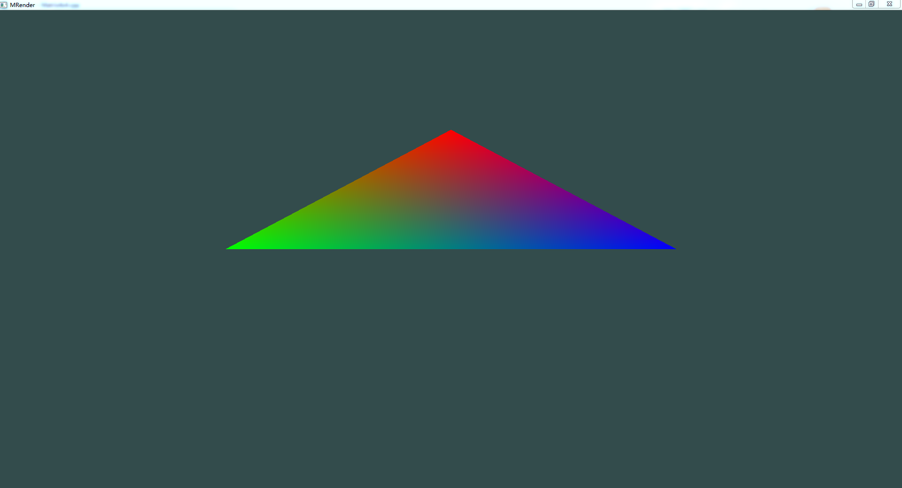
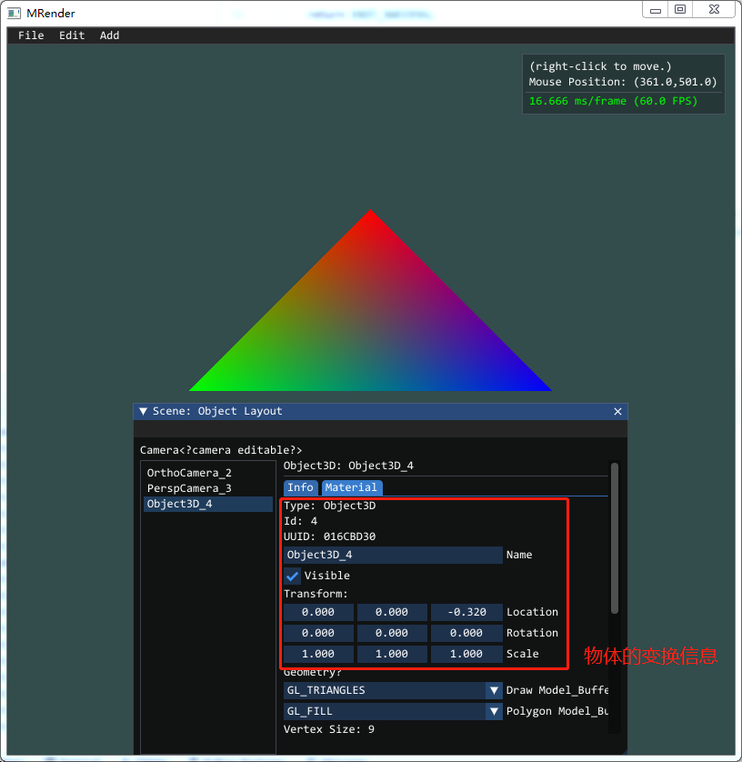
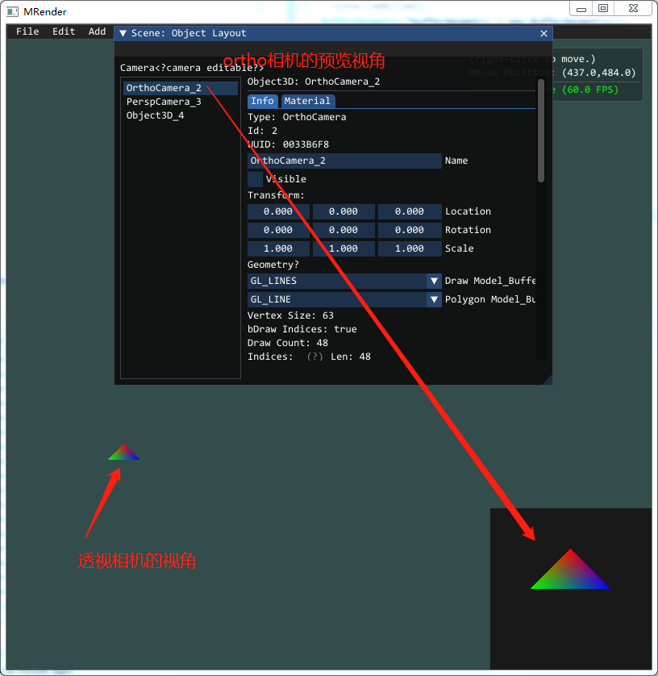

## 概述

在真正开始之前，我想先说说我的情况，目前我从事软件开发，不过工作上主要语言还是Java。

1. 编程基础，四年Java编程基础；工作上没用到C++，不过自己业余学习和使用C++大概1.5年左右，差不多是用到了才查，断断续续，没有系统性学习。
2. 图形学线性代数基础，目前才了解向量、矩阵的基本运算和变换基础，更高级的还没学。
3. OpenGL编程的一些基础知识，基础几何绘制、MVP变换、材质、光照等基础。
4. 还有一点WebGL的经验，实现了基础材质和光照。

为什么要写关于图形学的内容呢，缘由悠长。这一段可能会有些啰嗦，可以直接略过。

## 启蒙

第一次接触计算机，是在2008年的夏天。那时候小学六年级，学校地处西南偏远山区，一位老师要同时教授多门课程。那时候，我们学习也就语文和数学两门科目，另外的一门科学，我记得小升初的时候都没考试，老师讲的也少。剩下就是音体美课程了，因为都是一个老师，音体美很多时候也就当成自习上课。因此，相比现在的孩子小学三年级开始学习英语，那时我们晚了许多，计算机课程更是不可能了。

不过，那时候学校还是出现了一台电脑，也不清楚是老师自己买的还是上边分配下来，反正就是出现了，也通了网络。一天晚自习，老师7点左右上来班上说：“等会大家每个人提一个问题，然后下来我办公室，我用电脑给大家查答案。”，之后便走了。我想了很久，最后竟想到个问题：“**恐龙是怎么灭绝的？**”。如果问我小小年纪为啥想到这个，我也不知道，可能是受这方面一些读物或电视的影响吧。想到问题之后，我跟班上同学三三两两到达老师办公室。听到我的问题后，大家都止不住笑，不过最后老师还是查了。搜索引擎我忘了是啥，查到几个视频，大概也就是小行星砸地球的视频，就不赘述了。

印象较深的是，电脑品牌是方正，长得也很方正，显示器后面有包的大脑袋。搜索完了之后，花闪花闪的屏幕上出现的一排排搜索结果和红色的关键字。在此之后，就没接触过电脑了，一直到了初一，有有了信息技术这门课后，才用上了电脑，不过也是一星期一节课，45分钟，基本上就是听听歌，看看视频结束。

## 作为兴趣

到了2014年，我总算拥有了自己的的电脑，显示器也是液晶了。机缘巧合，我当时喜欢上了三维建模，学了学3dsMax。当时对**三维、图形学、物理模拟**非常感兴趣，有时候看一些教程会看到半夜。不过当时感觉建模跟UI设计一样，需要很多艺术细胞，设计这方面我并不擅长。所以当时就学了编程，Java的一些基础知识，用Java写过一些简单的安卓demo，比如四则运算计算器之类的。工作之后一直到现在则是Java EE。

不过，抛开主业，我从始至终对计算机图形学拥有浓厚兴趣。从2018年开始，利用业余，我断断续续在学习[UE4引擎](https://www.unrealengine.com/)。参照网上教程，用C++/蓝图写过FPS、汽车游戏的demo。但UE4太强大了，很多细节藏在内部，还好C++面向对象语言，我C++也写的不多，甚至可以说是拿Java思维来写C++，也是因为这样，我写C++时候会有很多Java的影子，导致的问题也会比较多。除了C++不熟外，就是图形学不熟，写出来的demo内部的向量、矩阵完全照抄，网上很多有趣的内容也实现不了。当我看到自己捣鼓出来的结果跟教程中差不多并且没办法弄出来自己想要的效果的时候，我意识到了问题的严重性：我这完全是照搬照抄啊！

这太可怕了，因为抄出来的内容完全不进脑子，过不久就忘了。所以，我觉得我得从基础开始，重新理解清楚。这也是我写这几篇笔记的缘由。

## 初衷

1. 好记性不如烂笔头；特别是我学习一些数学基础的时候，不手写我可能都理解不了。特别是现在信息爆炸的年代，很多知识不记录就忘了。
2. 锻炼文字表达能力；真正上手写的时候，才知道把语句写通顺了都是很困难的事，我特别佩服很多技术大佬，技术厉害，思维清晰，写出来的博客文章也是通俗易懂。
3. 记录过程；跟第一点很像，我更希望是我把目标理好，大纲列出来，然后细化得到小目标，再一步步完成小目标，这样提升就很快了。
4. 交朋友；如果有志同道合朋友，可以交个朋友，交流交流。

## 目标

1. 实现一个基于C++的OpenGL渲染器；
2. 渲染器要实现基本的几何绘制、基本变换、材质、光影（光照和阴影）等；
3. 利用渲染器学习光照、雾、云、流体和光追等；
4. 自己实现向量、矩阵和其他一些必要的数学方面内容。

## 任务分拆

> 后期会更细化任务，详细可以[访问这里](/posts/opengl_renderer/00_preview.html )查看，我会一直更新。

```
.
├── OpenGL基础绘制
│   ├── 绘制点、线、三角形、四边形、三维图形
│   └── end
├── mRender设计
├── 架构搭建
│   ├── 坐标系,左手还是右手? 矩阵，行矩阵还是列矩阵?
│   ├── glfw,imgui库
│   ├── 实现向量、矩阵（这部分具体实现放在对应章节，不细述）
│   ├── 实现log、file io、string..
│   ├── 架构搭之后，重新绘制[基础绘制]的内容。
│   └── end
├── 物体变换（Model Matrix）
│   ├── obj模型简单读取
│   ├── 线性变换 rotate、scale
│   └── 仿射变换 线性变换+translate
├── 视图变换 （View Matrix和Projection Matrix）
│   ├── 实现平行相机
│   ├── 实现透视相机
│   ├── 实现多视角
│   ├── 对象拾取
│   └── 物体实例化
├── 材质和光照
│   ├── 贴图
│   ├── 光照计算
│   ├── 多光源、可配置光照强度
│   ├── 粗糙度、金属度等等参数实现
│   └── 法线贴图
├── 阴影
│   └── 阴影其实没想好，还没看这部分的知识
├── 高级内容
│   ├── 立方体贴图
│   ├── 环境贴图、天空盒
│   ├── 蒙皮
│   ├── 雾
│   ├── 文字渲染
│   └── 粒子、精灵
└── 接下来的还没想好... 学无止境
```

## 渲染器概览

### 用到的库

1. glfw/glad，这两帮我创建出来窗口和opengl的指针管理，这个我就不实现了，太难了..
2. ImGui，全名应该叫 Dear ImGui，就是提供UI，直接放到glfw窗口中去，这个库用着太舒服了；
3. 没有了，至少目前我不打算引用其他的库了。

### 暂不准备使用的库

1. glm，数学库，很强大，直接可以提供仿射变换矩阵、透视矩阵等等一系列内容，这个我打算自己实现，不过会参考。

### 结构设计

几大对象，我参照的是[three.js](https://threejs.org/)，从程序入口进入后，由Renderer提供一个渲染窗口，构建好场景后，使用Renderer渲染场景。但因为three.js是js语言的原因，内部一些结构差距还是比较大。

伪代码：

```cpp
void main (){
    // 首先获得渲染器对象，初始化glfw、ImGui等，提供一个窗口
    Renderer *renderer = Renderer::getInstance("mRender", 800, 800);
    // 初始化一个场景
    Scene *scene = new Scene();
    // 给场景添加物体. 比如物体、灯光...
    scene->addSomeObject();
    // 渲染此场景
    render->render(scene);
    //内存回收
    SAFE_DELETE(scene);
    ...
}
```

类图设计：


## 重要的几个对象介绍

### BufferGeometry 缓冲几何体

这个类是所有几何体的基类，类主要的作用是存储几何体的顶点vertices、顶点颜色vertices color、顶点索引indices、顶点纹理坐标uvs和顶点法线normals。完成VAO、VBO和EBO的创建并给顶点着色器已定义的attribute变量赋值，VBO等数据缓存到一个map中保存，在绘制时绑定对应的VBO或者EBO后进行绘制操作。

举例：
如果要绘制一个彩色三角形，可以这样初始化：

```cpp
//内存回收内部会做，这里不用处理。后期可能要考虑把内存管理做的更完善一点！
BufferGeometry *bufferGeometry = new BufferGeometry(); 
bufferGeometry->vertices = {
        0.0f, 0.5f, 0.0f,
        -0.5f, 0.0f, 0.0f,
        0.5f, 0.0f, 0.0f
};

bufferGeometry->colors = {
        1.0f, 0.0f, 0.0f, 1.0f,
        0.0f, 1.0f, 0.0f, 1.0f,
        0.0f, 0.0f, 1.0f, 1.0f
};

//几何体不直接添加到场景中，需要一个物体对象，所以创建一个Object3D
//同上，内存回收内部会做，这里不用处理。
Object3D * colorfulTriangle = new Object3D();
colorfulTriangle->geometries.push_back(bufferGeometry);

//场景中添加此物体
scene->add(colorfulTriangle);

```

渲染结果应该是这样的：



### Object3D 三维物体
所有的三维物体都继承自Object3D。

Object3D中，定义了物体的几何构造、材质和变换信息。

- 几何构造BufferGeometry，几何构造是一个列表，没有先后关系和位置关系，这里后期可能要改。类似于很多引擎中的Attechment，并用位移、选择、缩放等局部变换完成关联。类似于，FPS游戏中，将武器的几何体关联到角色的手上。这里还是TODO，方案还没想好。
- 材质信息Material，材质相关的内容还没写多少，其实材质考虑是满足物体基色、贴图、光泽度、法线偏移、光照等等这些真实感渲染的。材质相关目前还是1%，才把基色写好，材质还没加。
- 变换信息Transform，记录了物体的位置、旋转和缩放信息，并保存当前物体的世界坐标矩阵ModelMarix。



### Scene 场景
场景继承自Object3D，它主要工作是维护整棵场景树。调用scene.add(Object3D object)，把object3d放到场景中去。然后由场景来管理Object3D，完成初始化init；在渲染时，场景完成自身的矩阵计算后，传给字对象，并调用子对象的render。以此链路完成场景中物体的初始化、渲染等操作。

> 目前子对象列表的维护还是使用vector，后期优化需要换成其他数据结构存储。

```cpp
// 初始化一个场景
Scene *scene = new Scene();
// 给场景添加Object3D,比如相机、物体、灯光...
scene->addSomeObject();
```

### Camera 相机
相机继承自Object3D，主要的目的是提供场景中的裁剪矩阵和视图矩阵。也就是大名鼎鼎的MVP矩阵中的P和V。

相机的分类，目前是分了平行相机和透视相机，我看了three.js中还有相机数组，来做场景的各个视角等等，这个后期用到了我再考虑要不要加上。

在场景中添加相机，也是添加一个3d对象，代码长这样：
```cpp
Camera *perspCamera = new PerspCamera();
//位置的一些调整
perspCamera->location.y = 2.0f;
perspCamera->location.z = 10.0f;
scene->add(perspCamera);
```
运行过程中，如果要切换视角，也就是换到另一个相机中去，可以这样使用(暂时还没考虑下高级切换，比如平滑切换等等)：
```cpp
scene->setActiveCamera(Camera*);
```
另外，类似很多引擎的一样，显示相机的预览，可以把相机中属性bPreview改为true，界面即可显示相机预览。


### MRenderer 渲染器
渲染器，是把glfw窗口管理起来，初始化、主循环、退出和按键、鼠标事件都是MRenderer来做，并把具体实现给到具体的对象中去。比如，负责设置opengl状态、渲染场景、渲染GUI操作。


## 结语
本文只是大概介绍了我要做一件什么事，然后预览了一个大概。接下来我根据大纲列出的一样，从零开始搭建。包括结构设计，后续笔记中会详细介绍。

