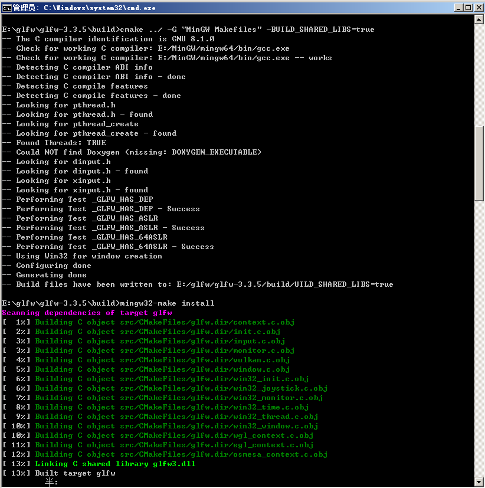
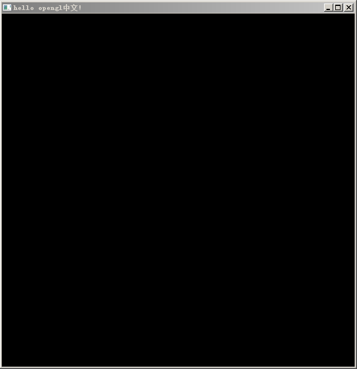
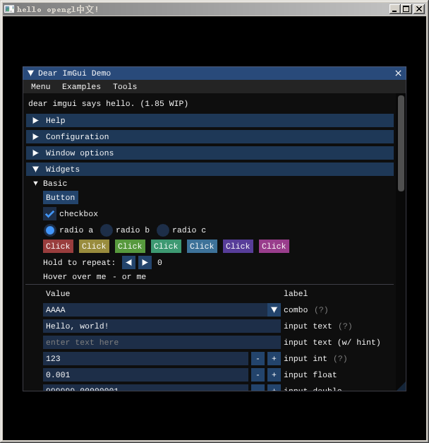

## 目标

> 原本计划是OpenGL环境就放在上一节（C++环境搭建）中一起记录的，后面发现内容太多了，所以就分开记录。

1. 使用glfw、glad和ImGui完成OpenGL环境的搭建；
2. 创建第一个glfw窗口；
2. 使用ImGui，显示ImGui的demo窗口。

## 计算机图形学

> 计算机图形学是使用数学算法将二维或三维图形转化计算机显示的栅格形式的科学，计算机图形学的主要研究内容就是研究如何在计算机中表示图形、以及利用计算机进行图形的计算、处理和显示的相关原理和算法。
>
> ——来自百度百科

> 《什么是计算机图形学》
>
> http://staff.ustc.edu.cn/~lgliu/Resources/CG/What_is_CG.htm 中国科学技术大学  刘利刚教授

图形学可以大致分为：

> 引用自 Fundamentals Of Computer Graphics(虎书)  Steve Marschner)/ [Peter Shirley

1. **建模(Modeling)**，对形状和外观性质进行数学几何定义。
2. **渲染(Rendering)**， 将模型生成带有光影的图形并显示到显示器上（栅格化）。
3. **动画(Animation)**，连续播放静态图像，产生物体运动的视觉效果。

所以，**图形学跟用什么语言、什么库实现并没有关系，底层是数学（另外还有物理相关的力学、光学等）**。

关于数学，我想说说我的看法：

数学很抽象的，无论是代数还是几何，很多都是抽象的概念。所以会有人开玩笑说：“学高数有啥用，你菜市场买菜并不会用到微积分”。其实出现这个情况，是因为有一些数学内容，虽然跟日常生活息息相关，但被抽象化到我们感受不到。所以计算图形学中用到的一小部分数学知识，比如数学概念中的函数，y=sinx，我们可以看到y能在-1~1中循环，可以用来生成真实感的水的波浪；使用线性代数中的矩阵知识，可以用来实现物体的变换、视图的变换。就会发现这部分数学就没那么抽象了，通过图形学能窥见一点点数学的有趣。

我现在了解到的，图形学会用数学的这一部分知识：

线性代数（主要也就是向量和矩阵，也算是计算机图形学的基础）、微积分、数值法、拓扑、统计等。

那么，最基本的，如何将图像显示到显示器上呢？这就需要GPU和图形库了。

## 图形库

常见的图形库有： Direct3D、OpenGL和Vulkan。

### 三个图形库对比

1. Direct3D，简称D3D。微软公司开发的图像处理接口，是DirectX多媒体处理接口中的一部分，一般是Windows系统使用。
2. OpenGL，跨平台图形库。发展已有20余年，被广泛应用在游戏、影视、军事、航空航天、地理、医学、机械设计，以及各类科学数据可视化等领域。
3. Vulkan，称作OpenGL的替代者，OpenGL还是隐藏了一部分显卡驱动的细节，Vulkan将其暴漏了出来，还支持多线程。但Vulkan学习门槛较高，需要对硬件驱动框架有综合的认识。

**最后，我决定使用OpenGL**。不为别的，就因为跨平台（主要别的图形库也不了解，不会用...）。不过，图形库还是一个工具，图形学知识基本都适用，所以我准备在渲染的底层数学这方面，尽量学得深入一点。

**OpenGL**


**OpenGL本身不是一个API**，只是定义了一整套由Khronos组织制定并维护的规范。所以它也不是库，不能调用，它就是一个协议、规范，严格规定每个函数的输入、输出，如何执行。其具体实现，基本上是显卡厂商自行开发，OpenGL规范并没有规定实现的细节，只要求功能和结果与规范相匹配即可。

我感觉OpenGL有点像是编程中的接口（interface），定义好所有的输入输出，但具体的实现接口就不管了。就像要实现一个数组排序，定好接口输入时数组，输出时排序后数组。具体的实现不管是冒泡排序、选择排序，甚至是猴子排序，也都可以。所以只要是OpenGL，接口名都很像。

还有几个跟OpenGL有关的拓展定义：

1. OpenGL ES：针对移动端，比如手机游戏机。
2. WebGL：针对Web端，允许把JavaScript和OpenGL ES 2.0结合在一起，通过增加OpenGL ES 2.0的一个JavaScript绑定，可以为HTML5 Canvas提供硬件3D渲染。

下边是基于OpenGL实现库的描述。

## 必备的库

提供窗口的库主要有以下几种：

1. glut，OpenGL的工具库。它可以用glBegin..glEnd来调用，类似的方式画一些图元。但版本有点老了，最后的版本更新时间1998年8月，并不推荐使用。
2. freeglut，glut的开源实现，完全兼容glut，开源、功能齐全。
3. glfw，C语言库，一个头文件和少量的API就可以完成任务，是一个轻量级的、开源的、跨平台的OpenGL库。

此外，GUI方面，自己写的话周期过长，而且要实现一个好看点的还挺麻烦，我觉得Dear ImGui是个不错的选择，也是轻量级API，API基本上都是静态方法，还有对glfw的原生支持，用起来会很方便。

**所以我决定使用glfw、ImGui ！**

### glfw

下载地址：https://www.glfw.org/download.html

使用版本：3.3.5

可以下载编译好的**二进制版本，也可以下载源码**。如果使用二进制版本，不管是预编译还是自己编译的，最终glfw会有两个重要的目录：

```
.
├── include
│	 └── GLFW
│		├── glfw3.h
│   	└── glfw3native.h
├── lib ###如果是二进制版本，lib会有很多不一样的版本支持，比如：lib-mingw,lib-vs2019...
│	 ├── glfw3.dll
│	 ├── libglfw3dll.a
│	 └── libglfw3.a
```

需要用glfw的项目就包含 %glfw%/include目录，并链接 lib目录到当前项目即可。链接库可以是静态链接，也可以是动态连链接。关于链接库的区别可以参考：[LIB和DLL的区别与使用](http://www.cppblog.com/amazon/archive/2009/09/04/95318.html)。

**编译源码**（可选）

> 源码编译使用上一节《从零开始写一个渲染器02_C++环境搭建》中的 CMake+MinGW构建和编译。

1. 解压glfw-3.3.5.zip。
2. 依次执行以下命令

```bash
cd glfw-3.3.5
mkdir build
cd build
# 这里需要../  在CMakeLists.txt目录下进行cmake才可以。 
# -G这里是要创建MinGW的Makefile
# -BUILD_SHARED_LIBS=true 生成.dll
cmake ../ -G "MinGW Makefiles" -BUILD_SHARED_LIBS=true
```
3. 执行编译、安装命令

```bash
mingw32-make install #install 默认会将文件写到 C:\Program Files (x86)\GLFW 中去
```



1. 前往 C:\Program Files (x86)\GLFW 目录下查看安装结果。**将 bin/glfw3.dll 复制一份到 /lib目录。**

### glad

glad是管理函数指针的，OpenGL很多函数指针没办法在编译期间确定，需要在运行时查询。如果不使用glad。我们查询函数指针要写额外的一些查询指针代码，繁琐复杂。类似下边这样：

> 引用自 https://learnopengl-cn.github.io/

```cpp
// 定义函数原型
typedef void (*GL_GENBUFFERS) (GLsizei, GLuint*);
// 找到正确的函数并赋值给函数指针
GL_GENBUFFERS glGenBuffers  = (GL_GENBUFFERS)wglGetProcAddress("glGenBuffers");
// 现在函数可以被正常调用了
GLuint buffer;
glGenBuffers(1, &buffer);
```

引入glad的话，直接使用就行：

```cpp
GLuint buffer;
glGenBuffers(1, &buffer);
```

**glad下载**

地址：https://glad.dav1d.de/

下载时候是根据配置生成的，配置如下：

| 配置          | 值                       |
| ------------- | ------------------------ |
| Language      | C/C++                    |
| Specification | OpenGL                   |
| API.gl        | Verson3.3（版本选择3.3） |

勾选【Generate a loader】，然后点击Generate，下载glad.zip并解压。

## 导入glfw、glad

### glfw

1. 在CLion中创建项目，

   将glfw中的glfw3.dll复制到lib文件夹，并将/include文件下的GLFW复制到项目的include文件夹下。

   项目目录：

```
.
├── include #包含外部头文件
│	 └── GLFW
│		├── glfw3.h
│   	└── glfw3native.h
├──  lib #库文件
│	 └──glfw3.dll
├── src
│	 └── main.cpp
└── CMakeLists.txt
```

2. 编辑CMakeLists.txt

```bash
# 版本号限定 可选
cmake_minimum_required(VERSION 3.0)
# 项目名称
project(00_setup_environment2)

# 文件复制
file(COPY lib/glfw3.dll DESTINATION ./)

# 源码
aux_source_directory(src/ SOURCE)

# 设置包含目录
include_directories(${PROJECT_SOURCE_DIR}/include)

# 可执行程序
add_executable(${PROJECT_NAME} ${SOURCE})

# 设置需要的链接库，导入glfw3.dll
link_directories(${PROJECT_SOURCE_DIR}/lib)
target_link_libraries(${PROJECT_NAME} ${PROJECT_SOURCE_DIR}/lib/glfw3.dll
```


### glad

1. %glad%/glad目录和glad/KHR目录复制到项目的/include目录。
2. %glad%/src/glad.c 复制到项目的/src目录。

此时项目目录：

```
.
├── include #包含外部头文件
│	 ├── glad
│	 	  └── glad.h
│	 ├── KHR
│	 	  └── khrplatform.h
│	 └── GLFW
│		├── glfw3.h
│   	└── glfw3native.h
├──  lib #库文件
│	 └──glfw3.dll
├── src
│	 ├── main.cpp
│	 └── glad.c
└── CMakeLists.txt
```

## Hello Window!

接下来我们实现第一个glfw窗口，这同时也是最基础的glfw程序，一般来讲，需要以下几个步骤：

1. glfw的初始化。
2. 创建窗口，设置上下文。
3. glad管理函数指针。
4. 渲染主循环。
5. 资源回收。

### 初始化

```cpp
glfwInit();
// 主版本 3.3，所以MAJOR=3,MINOR=3
glfwWindowHint(GLFW_CONTEXT_VERSION_MAJOR, 3);
// 次版本
glfwWindowHint(GLFW_CONTEXT_VERSION_MINOR, 3);
// 使用核心模式
glfwWindowHint(GLFW_OPENGL_PROFILE, GLFW_OPENGL_CORE_PROFILE);
```

上边的配置是不可省略的，设置主次版本和模式。

### 创建窗口并设置上下文

```cpp
//设置窗口宽高、名称
GLFWwindow* pWindow = glfwCreateWindow(WIN_WINDTH, WIN_HEIGHT, "hello opengl中文!", nullptr, nullptr);
//上下文设置
glfwMakeContextCurrent(pWindow);
```

WIN_WINDTH, WIN_HEIGHT是自定义的宏，指定窗口宽度和高度，“hello opengl中文”是窗口标题。

关于窗口的一些其他设置，比如icon、全屏、显示鼠标指针等属性可参考：[glfw窗口指南](https://www.glfw.org/docs/latest/window_guide.html)https://www.glfw.org/docs/latest/window_guide.html#window_full_screen

### glad管理函数指针

```cpp
bool bLoadSuc = gladLoadGLLoader((GLADloadproc) glfwGetProcAddress);
if(!bLoadSuc){
    std::cout << "Failed glad load glProcAddress!" << std::endl;
    return -1;
}
```

glad内部会判断版本（所以上边在下载glad时候，glfw的版本号要选择版本是3.3），然后从加载从1.0到现在版本的所有glfw函数指针。

### 主循环

```cpp
// 4.主循环
while (!glfwWindowShouldClose(pWindow)) {

	//渲染
	//draw scene.

	//交换缓存
	glfwSwapBuffers(pWindow);
	//事件处理
	glfwPollEvents();
}
```

这个代码就是主循环，渲染都是在这里面进行的，将会一直循环到窗口关闭为止。一次循环完成一帧。每一帧的结束进行缓存交换和事件处理。

glfwWindowShouldClose(GLFWWindows *) 返回窗口是否被关闭。

glfwSwapBuffers(GLFWWindows *) 交换缓存。默认glfw有两个缓存，一个是正在渲染的窗口，一个是缓存中准备渲染的窗口，这里就是执行两个缓存的交换操作。

glfwPollEvents() 事件处理。键盘事件、鼠标事件和窗口大小变化事件等（后续再详细写事件相关的内容）。

### 资源回收

```cpp
glfwTerminate();
```

主要是执行glfw资源回收，包括自定义对象的内存回收。

执行结果：



最基本的OpenGL程序：

```cpp
#include <iostream>

// glad.h 要放在glfw3.h之前
#include <glad/glad.h>
#include "GLFW/glfw3.h"

#define WIN_WINDTH 600
#define WIN_HEIGHT 600

int main(){
    std::cout<<"00_setup_environment2!"<<std::endl;
    // 1.初始化
    glfwInit();
    //主版本 3.3.5，所以MAJOR=3,MINOR=3
    glfwWindowHint(GLFW_CONTEXT_VERSION_MAJOR, 3);
    //次版本
    glfwWindowHint(GLFW_CONTEXT_VERSION_MINOR, 3);
    //使用核心模式
    glfwWindowHint(GLFW_OPENGL_PROFILE, GLFW_OPENGL_CORE_PROFILE);

    // 2.创建窗口 https://www.glfw.org/docs/latest/window_guide.html
    GLFWwindow* pWindow = glfwCreateWindow(WIN_WINDTH, WIN_HEIGHT, "hello opengl中文!", nullptr, nullptr);
    //上下文设置
    glfwMakeContextCurrent(pWindow);

    // 3.glad管理函数指针
    bool bLoadSuc = gladLoadGLLoader((GLADloadproc) glfwGetProcAddress);
    if(!bLoadSuc){
        std::cout << "Failed glad load glProcAddress!" << std::endl;
        return -1;
    }

    // 4.主循环
    while (!glfwWindowShouldClose(pWindow)) {

        //渲染
        //draw scene.

        //交换缓存
        glfwSwapBuffers(pWindow);
        //事件处理
        glfwPollEvents();
    }

    // 5.资源回收
    glfwTerminate();

    return 0;
}
```

## ImGui

在后续写渲染器过程中，会涉及到很多UI界面，方便运行中调试、界面设计等待。所以引入ImGui库。

ImGui全名是 Dear ImGui，开源免费轻量级GUI库，调用简单，而且后期对满足不了的需要可以更改源码。

地址：https://github.com/ocornut/imgui

打包下载或git clone下来源码，然后执行下列操作：

1. 导入源码，包含ImGui头文件和必要的cpp文件；
2. 修改CMakeLists.txt， 添加一个ImGui的静态链接库；
3. 修改main.cpp，添加ImGui的初始化和渲染代码；

### 包含头文件

1. 在%ImGui%/src中找到：

```
imconfig.h
imgui.cpp
imgui.h
imgui_demo.cpp
imgui_draw.cpp
imgui_internal.h
imgui_tables.cpp
imgui_widgets.cpp
imstb_rectpack.h
imstb_textedit.h
imstb_truetype.h
```

2. 在%ImGui%/backends中找到：

```
imgui_impl_glfw.h
imgui_impl_glfw.cpp
imgui_impl_opengl3.h
imgui_impl_opengl3.cpp
imgui_impl_opengl3_loader.h
```

一共16个源文件，复制到项目目录中的 /include 目录。

3. 另外，字体文件，打算用ImGui提供的几种默认字体。因此，在项目中创建resouce目录，并将%ImGui%/misc/fonts复制到resource下。

```
.
├── include #外部头文件
│	 ├── glfw...
│	 ├── imgui... #上述16个文件
├── lib
├── resource
│	 ├── fonts
│	  	  ├── font.ttf... #字体文件
├── src
└── CMakeLists.txt
```

### 修改CMakeLists.txt

更新内容带有 update 标识

```cmake
# 版本号限定 可选
cmake_minimum_required(VERSION 3.0)
# 项目名称
project(00_setup_environment2)

# 资源文件复制
file(COPY lib/glfw3.dll DESTINATION ./)
# 字体文件
file(COPY resource DESTINATION ./) #update1. 新加的资源操作

# 源码
aux_source_directory(src/ SOURCE)

# 设置包含目录
set(DIR_INCLUDES ${PROJECT_SOURCE_DIR}/include) #update2. 这里创建一个变量，包含目录
include_directories(${DIR_INCLUDES}) #update3. 包含目录设置

# 可执行程序
add_executable(${PROJECT_NAME} ${SOURCE})

# 设置需要的链接库
link_directories(${PROJECT_SOURCE_DIR}/lib)
## Imgui update4.0 添加静态链接库
add_library(imgui STATIC
        ${DIR_INCLUDES}/imgui/imgui.cpp
        ${DIR_INCLUDES}/imgui/imgui_impl_glfw.cpp
        ${DIR_INCLUDES}/imgui/imgui_impl_opengl3.cpp
        ${DIR_INCLUDES}/imgui/imgui_draw.cpp
        ${DIR_INCLUDES}/imgui/imgui_demo.cpp
        ${DIR_INCLUDES}/imgui/imgui_tables.cpp
        ${DIR_INCLUDES}/imgui/imgui_widgets.cpp)
    target_link_libraries(${PROJECT_NAME} ${PROJECT_SOURCE_DIR}/lib/glfw3.dll imgui) #update5.0 添加imgui库
```

### ImGui使用

0. 引入

```cpp
#include "imgui/imgui.h"
#include "imgui/imgui_impl_glfw.h"
#include "imgui/imgui_impl_opengl3.h"
```

1. 初始化

```cpp
// 检查版本
IMGUI_CHECKVERSION();
// 上下文
ImGui::CreateContext();
// 设置黑色主题
ImGui::StyleColorsDark();
// 嵌入住glfw上下文中
ImGui_ImplGlfw_InitForOpenGL(pWindow, true);
// OpenGL版本号3.3
ImGui_ImplOpenGL3_Init("#version 330");

ImGuiIO& io = ImGui::GetIO();
(void) io;
// 字体设置
io.Fonts->AddFontFromFileTTF("resource/fonts/Cousine-Regular.ttf", 13.0f, NULL, io.Fonts->GetGlyphRangesDefault());
io.Fonts->AddFontFromFileTTF("resource/fonts/DroidSans.ttf", 13.0f, NULL, io.Fonts->GetGlyphRangesDefault());
io.Fonts->AddFontFromFileTTF("resource/fonts/Karla-Regular.ttf", 13.0f, NULL, io.Fonts->GetGlyphRangesDefault());
io.Fonts->AddFontFromFileTTF("resource/fonts/ProggyClean.ttf", 13.0f, NULL, io.Fonts->GetGlyphRangesDefault());
io.Fonts->AddFontFromFileTTF("resource/fonts/Roboto-Medium.ttf", 13.0f, NULL, io.Fonts->GetGlyphRangesDefault());
```

2. 渲染

```cpp
// 1. ImGui渲染操作
ImGui_ImplOpenGL3_NewFrame();
ImGui_ImplGlfw_NewFrame();
ImGui::NewFrame();

// 2. UI准备（这里添加了一个ImGui默认提供的界面，可选）
bool bShowDemoWindow = true;// 控制UI是否渲染
// 显示ImGui自带的demo window
ImGui::ShowDemoWindow(&bShowDemoWindow);

// 3. 渲染
ImGui::Render();
ImGui_ImplOpenGL3_RenderDrawData(ImGui::GetDrawData());
```

3. 资源回收

```cpp
ImGui_ImplOpenGL3_Shutdown();
ImGui_ImplGlfw_Shutdown();
ImGui::DestroyContext();
```

结果：



## 结语

像开头所说，原本是打算跟前一篇《从零开始写一个渲染器02_C++环境搭建》放在一起的。没想到不小心又写的很啰嗦了。

另外，如果使用Visual Studio，可以参考 learn-opengl网站中描述来搭。好处就是不用建 include和lib目录了，在VS中包含进来头文件和库即可。

笔记中的过程都经过反复验证，但也可能存在一些问题。我放了源码在这里，可以交流交流。

源码地址： [00_setup_environment2](https://gitee.com/xingchen0085/m-render_demo/tree/master/00_setup_environment2)

https://gitee.com/xingchen0085/m-render_demo/tree/master/00_setup_environment2