## 什么是邮件服务器

邮件服务器是一种用来负责电子邮件收发管理的设备，而邮件服务就是责邮件的收信和发信功能，其最主要有`pop和smtp`两个协议。关于这两个协议，有着很多的知识点涵盖其中，这里不过多介绍。下面是我接触过的两个可以实现邮件服务的解决方案。

### 易邮邮件服务

在windows系统下，可以使用 易邮邮件服务 ，这个服务器简单而且实用，用在平时开发，测试或者局域网间的邮件收发还是挺方便的，不过我没有找到官方的，可以将易邮邮件服务安装在Linux的相关资料，因此不使用这个。这是易邮邮件服务的官方网站地址: https://www.eyousoft.net/

### Apache james

Apache 应该都不陌生，开源免费，对于我们开发者来说是最好的家园。当时我项目需要时，一直在找邮件服务相关资料，于是找到了它。Apache James相关资料不多，所以希望写篇博客将其记录。以备以后用到，也对邮件服务能够有更深入的理解。这是官方的介绍

> James stands for Java Apache Mail Enterprise Server!
It has a modular architecture based on a rich set of modern and efficient components which provides at the end complete, stable, secure and extendable Mail Servers running on the JVM.

通过介绍，不难看出，James小巧，可扩展而又不失强大，其支持pop，smtp以及相关SSL/TLS加密协议。可以用做开发测试，也可以对其扩展封装后作为企业级邮件服务。不过有一点需要说明的是，现在国内的很多云服务器是默认关闭 25 端口的，也就是默认不能使用未加密的 smtp 发送邮件，据说是为了减少垃圾邮件的产生。下图是其云服务提供商的解释截图（这个问题我自己找了很久，当时在本机测试代码完全没问题，但发布到服务器发现项目无法启动，最后无法解决，就用了AWS亚马逊云服务器作为邮件服务器测试，最终成功）。如果服务器是国内云服务器，需要实现和外网（如QQ,163邮件服务）之间收发邮件的话，只有三个办法：
1.申请开通25端口。不过申请基本不会通过...
2.使用加密的smtp协议传输。其端口则可以使用 465 等，避免使用25端口。
3.使用aws服务器。网上也听说会封25端口，不过我当时（2017年12月份末）测试时，还是可以使用的。

那么，我们现在搭建的邮件服务，如果不发布到云服务器或者企业独立的服务器，是无法收到外网邮件服务器发的邮件的，其实也很好理解，因为外网的服务器根本找不到你的邮件服务器在哪里，找不到你的机器IP地址。不过这不影响邮件**发送**，和**局域网内的邮件收发**功能。因此，以下的邮件服务搭建主要实现的功能就是：
1.局域网内的所有邮件收信和发信（普通邮件，Html邮件，附件邮件）；
2.外网的邮件发送（如果有条件测试邮件接收功能是最好的）。

将会分别在Windows平台和Linux平台搭建。

## Windows平台安装配置

>说明：本机测试使用的是 win10系统

### 下载，解压

下载地址： https://james.apache.org/download.cgi 

### 配置开始

首先，前往 **`james-2.3.2.1\bin`** 找到 **`run.bat`**，双击启动，会发现启动以后窗口自动关闭，这是因为没有配置的原因，可能会启动失败，不过不要紧，这一次启动会生成一个文件，它就在 **`james-2.3.2.1\apps\james\SAR-INF\`**目录下，文件名 **`config.xml`**,现在配置的重点就是这个文件（如果不启动一次，这个文件是没有的）。

#####配置config.xml

修改xml代码，将所有localhost 替换为你的邮箱域名，这个可以随便写一个，等会配置一下hosts文件，将域名指向本机，即可将本机的james作为邮件服务器。

```xml
<!-- 配置这里，将这个xml文件的localhost替换成你的域名(这里测试使用xingchen.cn)-->
<postmaster>Postmaster@xingchen.cn</postmaster>
```

邮件数据存储选择，根据xml来看，提供的有3中数据存储方式：
1.file:// 文件存储
2.db:// 数据库存储
3.dbfile:// 数据文件式存储

这些数据存储方式可以根据自己实际需求来定，不过如果选择文件存储方式，在启动时会出现找不到文件等错误，所以需要确认已经创建好文件夹再启动。当时为了方便，所以选择的是数据库存储方式，数据库使用Mysql数据库存储，因此需要作一下代码变更。如果你不需要使用数据库存储，就可以跳过数据库相关配置，包括 驱动包的导入，DBCP连接池配置等。

Mysql数据库配置 1：
``` xml
<!-- 	重要说明：	注释掉默认的  file://  ，这个在文件中有好几处地方，修改方式雷同，都要注释掉默认的这个，再打开数据库存储方式的配置
<inboxRepository>
	<repository destinationURL="file://var/mail/inboxes/" type="MAIL"/>
	</inboxRepository>
-->

<!--使用数据库作为数据存储-->
<inboxRepository>
	<repository destinationURL="db://maildb/inbox/" type="MAIL"/>
</inboxRepository>
```
Mysql数据库配置 2：
将mysql的驱动包拷贝到 **`james2.3.2\lib`**目录下

Mysql数据库配置 3：
找到 `<data-source>` 节点 配置数据库连接
```xml
<data-source name="maildb" class="org.apache.james.util.dbcp.JdbcDataSource">

	<driver>com.mysql.jdbc.Driver</driver>

	<dburl>jdbc:mysql://127.0.0.1/mail?autoReconnect=true</dburl>

	<user>username</user>

	<password>password</password>

	<max>20</max>

</data-source>
```

Mysql数据库配置 4：在Mysql数据库中添加一个空的数据库 mail ,数据库只能是mail,以后的数据都将会存储在这个数据库中。

找到 `<administrator_accounts>`,将`!changeme!`改掉,等会登录使用的就是这个密码。

```xml
<administrator_accounts>

	<!-- CHECKME! -->

	<!-- Change the default login/password. -->

	<account login="root" password="!changeme!"/>
</administrator_accounts>
```

找到` <servernames>`,将两true改为false

```xml
<servernames autodetect="false" autodetectIP="false">
	<!-- CONFIRM? -->

	<servername>xingchen.cn</servername>

</servernames>
```
  ​

找到下面的代码，注释掉。

```xml
<!--
<mailet match="InSpammerBlacklist=dnsbl.njabl.org." class="ToProcessor">

	<processor> spam </processor>

	<notice>550 Requested action not taken: rejected - see https://njabl.org/</notice>

</mailet>
-->
```

  ​

配置 DNSServer, 使用Google 的 Public DNS (还可以使用阿里云的DNSServer，之前我测试没毛病，可以使用，查阅地址参考：https://baike.baidu.com/item/dns/427444?fr=aladdin#14 )： 

```xml
<servers>
  <server>8.8.8.8</server>         
  <server>8.8.4.4</server> 
</servers>
```


此时，再次运行 `run.bat `即可。如果看到以下界面，说明安装成功。

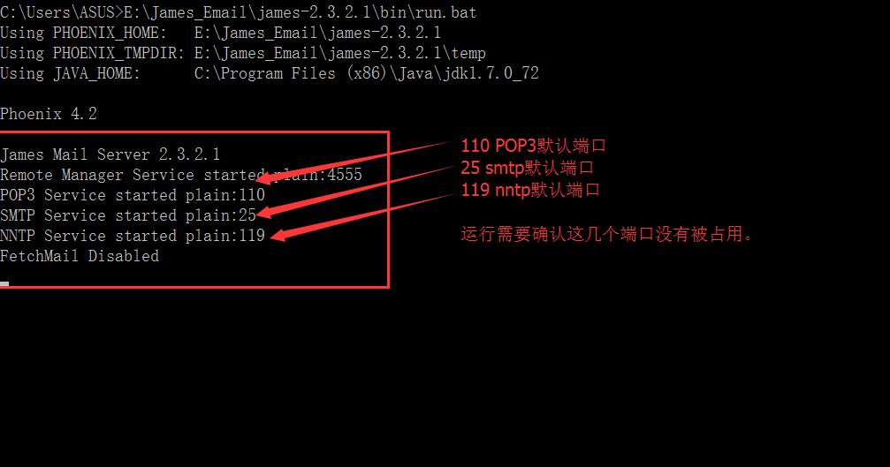
3.客户端登录

使用telnet指令登录

   ```bash
telnet localhost 4555
#因为是本机服务，所以直接使用localhost连接邮件服务器
   ```

4.添加用户

```bash
adduser test test
```

这个命令很简单，就是添加一个用户名为 `test@yourdomain.com` ，密码 test 的用户只要在注册一个用户，就可以实现邮件互发了。下面举例使用 Foxmail 测试邮件收发。


#### Windows测试邮件收发

1.测试工具 ： Foxmail客户端
2.前提：两个注册在你的邮件服务器的帐号
3.预计实现结果：正常收发邮件，包括普通文本、富文本格式和附件收发。

##### 注册帐号

```bash
adduser test2 test2
```

因为上文中也提到，已经有一个帐号 test 了，所以这里添加另外一个，这里的密码已经加密，由James内部实现。你可以前往数据库 Mail 的users表中查看相关信息。如下图

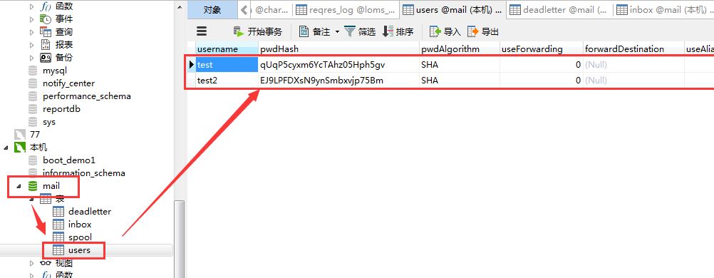


##### Foxmail设置

安装，打开foxmail,将我们刚刚注册的两个用户添加进去。步骤如下：

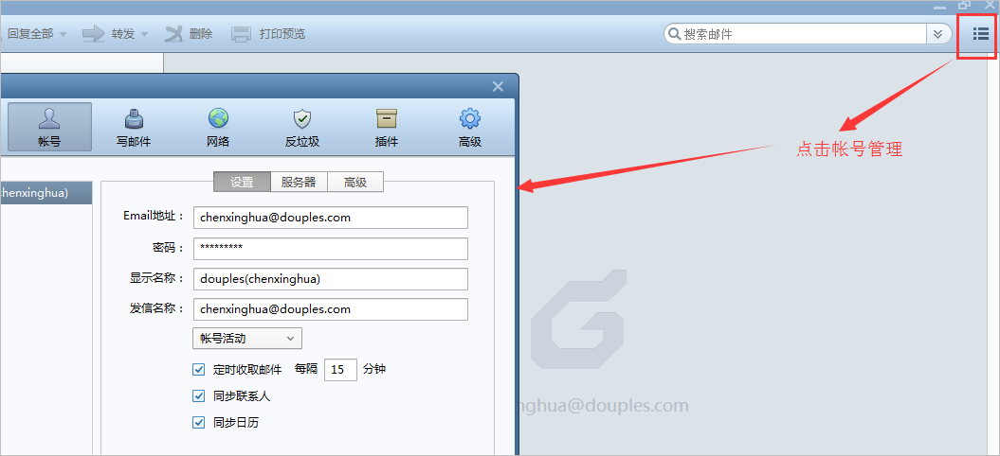

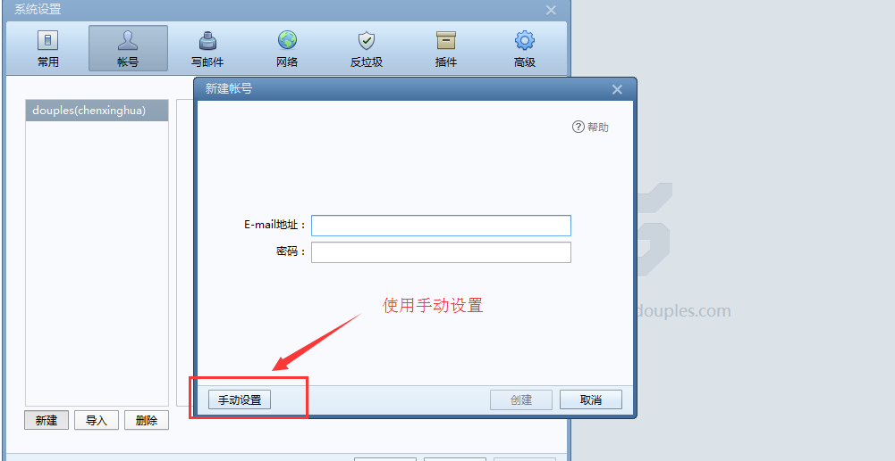

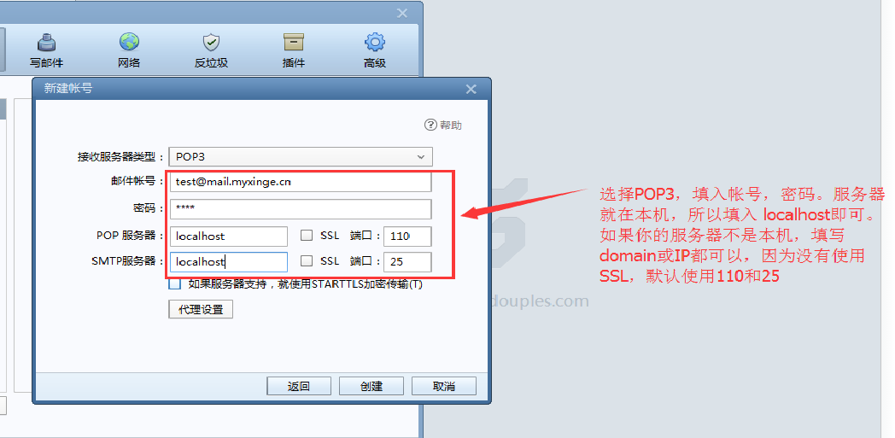


另一个号以此为例，创建即可。


##### 测试开始

第一封：普通文本

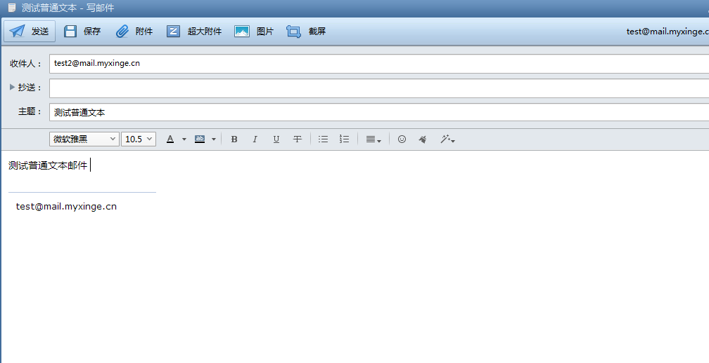

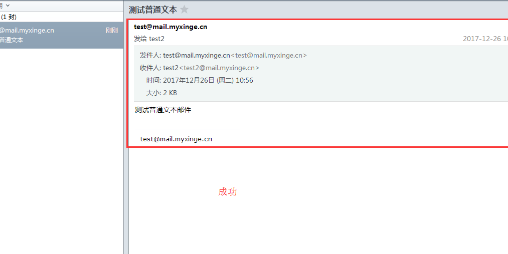

因为篇幅有限，富文本格式和附件收发测试就不截图了。本机测试可行，配置无误应该都没问题。


**至此，Windows环境下配置，测试完毕。其中比较繁琐的是 config.xml的修改配置，如果发现启动失败，报错情况。很大可能是这个配置未完整或者有误。在文章后面我会提供一个本机测试可用的 config.xml 文件。**

## Linux平台安装配置

> 说明：Linux系统环境是 CentOS6.8  32位机器。

### 上传安装包 解压

软件包在上文已经提供，直接将 tar.gz 安装包下载下来，并上传至服务器解压即可。

```shell
#解压命令
tar -zxvf james-binary-2.3.2.1.tar.gz
```

### 首次启动

```shell
./run.sh
```

如果出现 `-bash: ./run.sh: Permission denied`,说明没有执行的权限，需要给当前用户添加一个可执行的权限。

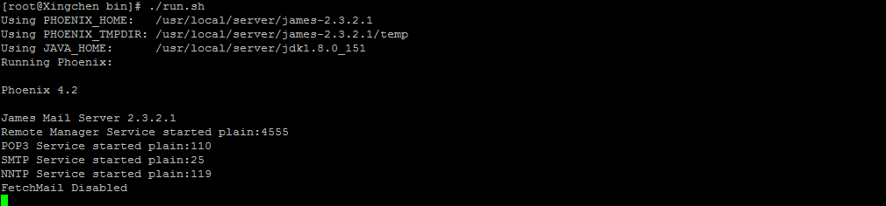

可以发现执行成功。此时 使用 Ctrl + C  终止程序 。

### 配置

1.开始配置 `//apps/james/SAR-INF/config.xml` .具体配置和windows上配置大同小异，DNSServer使用Google 的 Public DNS ： 

```xml
<servers>
  <server>8.8.8.8</server>         
  <server>8.8.4.4</server> 
</servers>
```

2.同样，数据库相关也要根据你的服务器中安装的Mysql做相应配置。

```xml
<data-source name="maildb" class="org.apache.james.util.dbcp.JdbcDataSource">
  <driver>com.mysql.jdbc.Driver</driver>
  <dburl>jdbc:mysql://127.0.0.1/mail?autoReconnect=true</dburl>
  <user>root</user>
  <password>yourMysqlPwd</password>
  <max>20</max>
</data-source>
```

3.将数据库驱动添加到 `//lib` 目录下。

4.创建数据库 mail

```shell
mysql> create database mail;
Query OK, 1 row affected (0.00 sec)
```

5.启动

6.测试连接

可以使用本机或者别的电脑测试连接 4555端口，如下：

```shell
telnet 你的IP  4555
```

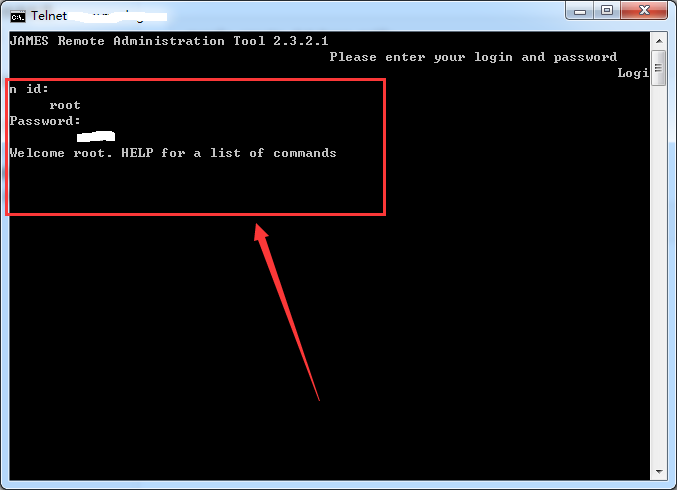]

似曾相识页面出来了，这样就可以添加用户，邮件收发啦...

```shell
adduser admin@yourdomain password
```


### Foxmail测试

此时，将刚新建的用户配置到foxmail客户端中即可收发所有邮件。

与上文的Windows测试大同小异，不细述。


## 常见的坑

1.报错一 ： **`java.io.IOException: 文件名、目录名或卷标语法不正确。`**

原因：这个报错的原因是用户信息，邮件收发产生的数据存储路径有误，默认使用的是文件存储。

解决：参考文章前半部分

​	a. 找到 **所有的 destinationURL** ,默认配置的是 'file://var/mail....'，就是使用文件存储，这里将其注释。如下图所示：

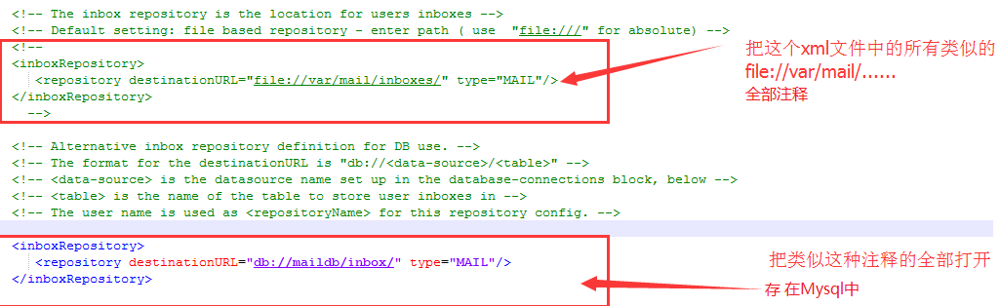

​	b.把数据库驱动添加到 //lib/ 目录下，我这里用的是Mysql,所以将 mysql-connector-java-5.1.39-bin.jar 添加到 lib 文件夹下。

​	c.在数据库中创建一个 名为  mail 的数据库。当再次运行后James内部就会自动创建几个表。如下:

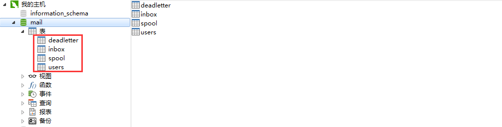

​	此时，再次启动，应该就成功了。


2.报错二 ： `om.mysql.jdbc.exceptions.jdbc4.MySQLSyntaxErrorException: Unknown database 'mail'`

原因：没有创建数据库 mail ,创建即可解决。这是由这项配置决定的，需要确认填写无误，还有数据库驱动已加入其中即可避免。

```xml
<data-source name="maildb" class="org.apache.james.util.dbcp.JdbcDataSource">
  <driver>com.mysql.jdbc.Driver</driver>
  <dburl>jdbc:mysql://127.0.0.1/mail?autoReconnect=true</dburl>
  <user>root</user>
  <password>yourMysqlPwd</password>
  <max>20</max> 
</data-source>
```

3.无法收发外网邮件

原因：这个错误原因会比较多，也很难总结，包括安装，配置，帐号等方面都有可能出问题。不过大多数还是配置出错引起的。可以参考这篇文章：[Apache James使用的方法及相关心得（转）](https://www.cnblogs.com/softidea/p/5348057.html)，这是博客园上的文章，感谢原作者的分享和总结，当时我也是根据这篇文章解决无法的收发外网邮件的BUG。

4.说明：如果没有独立域名和服务器，没有独立的公网IP地址，无法真正做到收外网邮件,不过为了满足开发测试，可以在hosts文件中添加伪域名，实现其功能。

## 总结
是的，又是造轮子，但是对于技术提升和代码实践还是很有帮助，可以更深理解别人的代码思想，技术逻辑。其实我一直觉得，技术对我来说，把坑挖得越深越好，理解越透彻越好，代码不在于多，而在于真正理解编程思想，解决实际问题。这才是编程的实际意义。
